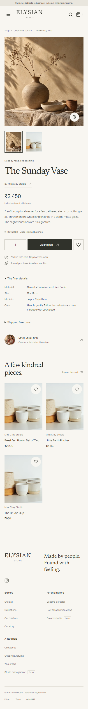
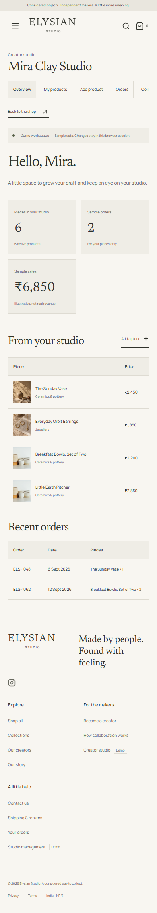

# Elysian Studio

<p align="center">
  
</p>

<p align="center"><strong>Crafted with Soul, Wrapped in Emotion</strong></p>

A handmade marketplace and creator collaboration demo built for a Database Systems Engineering project. Customers discover independent makers and shop their work; creators manage products and collaborations; admins review applications, inventory and orders.

The storefront runs on React, Vite and TypeScript. An Express API handles authentication and marketplace operations, with MongoDB persistence through Mongoose. A browser-only mock mode is also available.


## Contents

- [Features](#features)
- [Tech stack](#tech-stack)
- [Run locally](#run-locally)
- [Open on your local network](#open-on-your-local-network)
- [Demo accounts](#demo-accounts)
- [Commands and validation](#commands-and-validation)
- [Architecture](#architecture)
- [Folder structure](#folder-structure)
- [Screenshots](#screenshots)
- [Demo boundaries](#demo-boundaries)
- [Troubleshooting](#troubleshooting)
- [Project documentation](#project-documentation)

## Features

| Workspace | Included workflows |
| --- | --- |
| Storefront | Animated entrance, editorial homepage, collections, categories, creator directory and profiles |
| Shopping | URL-based search, category and price filters, sorting, pagination, product galleries and stock-aware quantities |
| Customer | Registration and login, bag, wishlist, checkout preview, order history, profile, addresses and preferences |
| Creator | Product creation and editing, order overview, collaboration applications and review status |
| Admin | User and creator management, collaboration reviews, products, categories, inventory, orders, sample payments and summary analytics |

Signed-in bags, wishlists and account data persist in MongoDB. Anonymous bags and wishlists stay on the device and merge when the customer signs in. Layouts support desktop and mobile, with keyboard navigation and accessible loading, error and empty states. The entrance can be skipped; its animation deliberately plays even with reduced motion enabled, while the rest of the site respects that preference.

## Tech stack

| Layer | Tools |
| --- | --- |
| Frontend | React 19, React Router 7, TypeScript 5.8, Vite 6 |
| Styling | CSS Modules, shared CSS design tokens, locally bundled Newsreader and Manrope fonts, Lucide icons |
| API | Express 5, Zod validation, bcrypt password hashing, JWT authentication |
| Database | MongoDB, Mongoose 9, indexed collections and aggregation-based admin summaries |
| Validation | ESLint, Vitest, Testing Library, Playwright and axe accessibility checks |

## Run locally

### Prerequisites

- **Node.js 22** and npm are the recommended runtime for this project. Node 26 on Windows has shown intermittent test-worker startup errors.
- **MongoDB Server** running locally on port `27017`, or a MongoDB connection URI you control.
- **Git** to clone the repository. MongoDB Compass is optional for inspecting records.

Run all npm commands from the repository root. There is one dependency installation for the frontend, backend and database code.

### 1. Clone and install

```sh
git clone https://github.com/VishnuVardhan-719/ELAYISIAN-STUDIO__E-COMMERECE.git
cd ELAYISIAN-STUDIO__E-COMMERECE
npm ci --include=dev
```

Use `--include=dev` even if your machine sets `NODE_ENV=production`; otherwise npm may omit the build and test tools.

### 2. Configure the environment

PowerShell:

```powershell
Copy-Item frontend/.env.example frontend/.env.local
Copy-Item backend/.env.example backend/.env
```

macOS / Linux:

```sh
cp frontend/.env.example frontend/.env.local
cp backend/.env.example backend/.env
```

For an existing checkout, keep your environment files rather than overwriting them. Generate a secret with the command below and set `JWT_SECRET` in `backend/.env` to its output:

```sh
node -e "console.log(require('node:crypto').randomBytes(32).toString('hex'))"
```

| File | Variable | Purpose |
| --- | --- | --- |
| `frontend/.env.local` | `VITE_API_MODE=rest` | Use the Express API; `mock` selects the browser-only demo |
| `backend/.env` | `PORT=4000` | API port |
| `backend/.env` | `MONGODB_URI=mongodb://localhost:27017/elysian` | Database connection |
| `backend/.env` | `JWT_SECRET` | Private signing secret; replace the example value |
| `backend/.env` | `JWT_EXPIRES_IN=7d` | Session token lifetime |
| `backend/.env` | `CLIENT_ORIGIN=http://localhost:5173` | Allowed origin for direct browser requests to the API |

Private environment files are Git-ignored. Never put database credentials or JWT secrets in `VITE_` variables: those variables can be included in the browser bundle.

### 3. Start MongoDB and initialize a fresh demo

Keep MongoDB running before starting the API. On Windows, if you installed the `MongoDB` service, run this in an elevated PowerShell window:

```powershell
Start-Service MongoDB
```

For a **new, disposable demo database**, check `MONGODB_URI`, then initialize it:

```sh
npm run seed
```

**Seeding deletes existing records in all ten application collections in the configured database.** Skip this step if your database already contains data you want to keep. Use `npm run db:inspect` for read-only counts and topology instead.

### 4. Start the application

```sh
npm run dev:all
```

| Service | Default address |
| --- | --- |
| Storefront | `http://localhost:5173` |
| API health | `http://localhost:4000/api/health` |
| MongoDB | `mongodb://localhost:27017/elysian` |

Vite prints the actual website address if port `5173` is occupied. To run each service in its own terminal, use `npm run dev:api` and `npm run dev`. Stop the development processes with **Ctrl+C**.

### Browser-only mode

Set `VITE_API_MODE=mock` in `frontend/.env.local`, restart Vite, and run `npm run dev`. This mode does not need MongoDB or Express; its demo data stays in browser storage rather than being shared between devices.

## Open on your local network

`npm run dev` already binds Vite to `0.0.0.0`. With the application running:

1. Connect your computer and phone or other device to the same trusted network.
2. Find your computer's IPv4 address with `ipconfig` on Windows, or use the **Network** address printed by Vite.
3. On the other device, open `http://YOUR_COMPUTER_IPV4:5173`, using the port Vite actually reports.
4. If the page cannot load, allow the Vite/Node process through your firewall on the appropriate trusted network. Campus or guest Wi-Fi may block device-to-device traffic.

The browser requests `/api` through Vite, which proxies to the API on the host computer. You do not need to change the API URL to the phone's `localhost`, expose MongoDB, or relax CORS for this workflow. This is a development server for trusted local access, not a public deployment.

## Demo accounts

These accounts are supplied by the demo seed and are also available in mock mode:

| Role | Email | Password |
| --- | --- | --- |
| Customer | `ananya@example.test` | `elysian123` |
| Creator | `mira@example.test` | `elysian123` |
| Admin | `studio@example.test` | `elysian123` |

These are fictional demo credentials, not production accounts. Do not publish a real deployment with the seeded accounts enabled.

## Commands and validation

| Command | Purpose |
| --- | --- |
| `npm run dev:all` | Start the API and storefront together |
| `npm run dev` | Start the Vite storefront, available on the LAN |
| `npm run dev:api` | Start the Express API with watch mode |
| `npm run typecheck` | Check frontend, backend and imported database code |
| `npm run lint` | Run ESLint |
| `npm test` | Run frontend unit and backend integration tests |
| `npm run test:frontend` | Run frontend tests only |
| `npm run test:backend` | Run backend tests only; requires MongoDB |
| `npm run test:e2e` | Run isolated Playwright browser tests; requires MongoDB and Chromium |
| `npm run build` | Build the storefront into `frontend/dist/` |
| `npm run preview` | Preview the built storefront; start the API separately for REST mode |
| `npm run db:inspect` | Inspect database counts and topology without modifying records |
| `npm run seed` | Destructively initialize/reset the configured demo database |

Run the project checks:

```sh
npm run typecheck
npm run lint
npm test
npm run build
npx playwright install chromium
npm run test:e2e
```

`npm run preview` serves `frontend/dist/` locally and proxies `/api` to the development API; run `npm run dev:api` separately. MongoDB must be running for backend tests. Unit tests use separate `elysian_test_*` databases; browser tests seed only `elysian_e2e` and start their own API on port 4001 and website on port 5174. They do not reset `elysian`. Reports are written to `frontend/playwright-report/`; visual captures are in `frontend/screenshots/`. Run `npm run test:frontend` or `npm run test:backend` to check either side separately.

## Architecture

```text
React pages and components
          |
frontend/src/services/api.ts
          |
          +-- mockAdapter --> browser storage
          |
          +-- restAdapter --> /api --> Express routes
                                           |
                                  backend/src/store.ts
                                           |
                                  Mongoose --> MongoDB
```

- `frontend/src/types/domain.ts` defines shared marketplace shapes and string identifiers such as `sunset-vase` and `mira`.
- Components use the service layer rather than importing demo catalogue data directly.
- `frontend/src/services/http.ts` attaches Bearer tokens and translates API errors.
- Express routes validate writes with Zod and enforce roles and ownership server-side.
- `frontend/src/data/mock.ts` is the shared catalogue source for mock mode and the explicit database seed.
- Ten MongoDB collections cover users, creators, categories, products, collections, orders, payments, addresses, collaborations and carts. See [database documentation](database/README.md) for schemas, indexes, relationships and aggregation queries.

Shared design tokens live in `frontend/src/styles/tokens.css`, global styles in `frontend/src/styles/global.css`, and scoped styles in CSS Modules. Route bundles are lazy-loaded. The image map is centralized in `frontend/src/data/assets.ts`.

## Folder structure

All npm commands run from the repository root. There is one `package.json`, lockfile, and dependency installation; no separate install is needed inside the application folders.

```text
frontend/
  src/                 React pages, components, contexts, services, types, tests
  public/              Images and other static assets
  scripts/             Asset preparation and browser screenshot helpers
  tests/               Playwright browser tests
  screenshots/         Saved visual captures
  index.html
  vite.config.ts
  playwright.config.ts
  tsconfig.json
  .env.example
backend/
  src/                 Express entrypoint, routes, middleware, data operations
  tests/               Authentication, route, and store integration tests
  scripts/             Existing API smoke script; writes demo records if run
  archive/             Preserved Phase 2 in-memory store backup
  vitest.config.ts
  tsconfig.json
  .env.example
database/
  src/db.ts            MongoDB connection and topology helpers
  src/models/          Mongoose schemas and indexes
  src/seed.ts          Explicit, destructive demo seed
  scripts/             Read-only local database inspection
  README.md            Collection, index, and checkout documentation
docs/                  Validation history, asset provenance, implementation plans
.context/              Saved project context and local verification history
PROJECT REVIEW/        Original project-review PDFs
```

Use `npm run db:inspect` for read-only development database counts and topology. MongoDB stores its actual database files outside this repository; `database/` contains application database code, not a copy of the live records.

## Screenshots

Saved screenshots illustrate the demo UI; they are not a live deployment.

| Storefront | Administration |
| --- | --- |
|  |  |

<details>
<summary>Mobile product and creator workspace</summary>

<p>
  
  
</p>

</details>

## Demo boundaries

The catalogue and payment records are illustrative. Authentication uses bcrypt and JWTs, and the server enforces roles and ownership. There is no real payment processing, email delivery, or file upload service. Checkout records a sample payment, not a charge.

Signed-in bags, wishlists, orders, profiles, addresses, products and collaboration decisions persist in MongoDB. Anonymous bags and wishlists remain on the device and merge when signing in. Creator follows remain local. `resetDemoData()` resets browser demo state only; `npm run seed` explicitly resets the configured database.

On the local standalone MongoDB instance, checkout uses conditional stock updates and compensating rollback for handled failures. This is **not a crash-safe multi-document transaction**. A replica set or Atlas deployment enables the transaction path; that path is not integration-tested by the standalone test setup. Keep this deployment local rather than presenting it as a production payment system.

## Build and deployment notes

`npm run build` produces the frontend only, not a bundled backend deployment. `npm run preview` is a local preview server. For a hosted REST setup, serve `frontend/dist/`, rewrite browser routes to `index.html`, and proxy `/api` to a separately managed Express process. Keep server secrets outside the client bundle and use HTTPS. The payment and checkout limitations above still apply.

## Troubleshooting

| Symptom | Check |
| --- | --- |
| Vite, TypeScript or Vitest cannot be found | Reinstall from the root with `npm ci --include=dev` |
| API exits with a MongoDB connection error | Start MongoDB and verify `MONGODB_URI` in `backend/.env` |
| REST catalogue is empty or demo login fails on a fresh checkout | Confirm the intended disposable database has been seeded; do not reset an existing database just to debug |
| Frontend requests to `/api` fail | Start `npm run dev:api`; Vite's proxy defaults to `http://127.0.0.1:4000`. If you change the API port, set `API_PROXY_TARGET` in the Vite process environment to match |
| Test workers fail to start on Node 26 | Use the recommended Node 22 runtime; a sequential diagnostic run is `npm test -- --maxWorkers=1 --no-file-parallelism` |
| Phone cannot open the storefront | Use the computer's LAN IP, the reported Vite port, a trusted firewall rule and a network that permits peer access |
| Refreshing a hosted page returns 404 | Configure the host to fall back to `index.html` for frontend routes |

## Project documentation

- [Database schemas, indexes and checkout behavior](database/README.md)
- [Image and font provenance](docs/assets/ASSETS.md)
- [Validation history](docs/VALIDATION.md)
- [Original project-review documents](PROJECT%20REVIEW/)

The catalogue, creators and payment records are fictional demonstration content. Asset-specific provenance and package licenses apply; no project-wide open-source license is declared in this repository.
