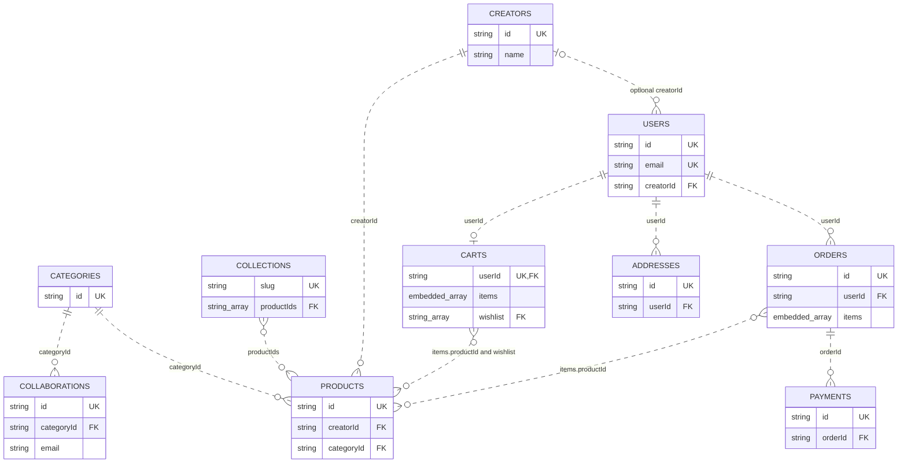

# Elysian Studio database

Elysian Studio uses MongoDB through Mongoose. The development database is `elysian` at `mongodb://localhost:27017/elysian`. This document describes the implemented schemas in `database/src/models/`, the seed in `database/src/seed.ts`, and the operations in `backend/src/store.ts`. The connection is in `database/src/db.ts` and reads the backend environment in `backend/.env`. Actual MongoDB data files are managed by the installed service outside this repository.

## Storage conventions

- There are ten collections: `users`, `creators`, `categories`, `products`, `collections`, `orders`, `payments`, `addresses`, `collaborations`, and `carts`.
- MongoDB gives each top-level document an ObjectId `_id` with its automatic unique `_id_` index. Application links use the existing string identifiers, such as `sunset-vase`, `mira`, and `ceramics`, rather than ObjectIds. `collections` uses `slug` as its application key; `carts` uses `userId`.
- Shared schema options disable `__v` with `versionKey: false`. No schema enables automatic timestamps. `date` is a string, not a BSON Date; application-created order and collaboration dates use `YYYY-MM-DD`.
- JSON serialization removes `_id`. Store reads sanitize lean results, and analytics projections exclude `_id` and `__v`. User queries exclude `passwordHash` unless authentication explicitly selects it; user JSON also removes it.
- Relationships are application-managed string references. The schemas do not declare Mongoose `ref` fields or database-enforced foreign keys. A unique index prevents duplicate keys, but does not establish referential integrity.

## Collection fields

The tables list every application field. All top-level collections also have the MongoDB `_id` described above. Required means the schema explicitly sets `required: true`; defaults and enum constraints are listed separately.

### `users` — model `User`

| Field | Type | Rules and relationship |
| --- | --- | --- |
| `id` | String | Required, unique application key |
| `name` | String | Required, trimmed |
| `email` | String | Required, unique, lowercased and trimmed |
| `passwordHash` | String | Required bcrypt hash; excluded from normal query selection and user JSON |
| `role` | String | `customer`, `creator`, or `admin`; default `customer` |
| `creatorId` | String | Optional link to `creators.id` for a creator account |

### `creators` — model `Creator`

| Field | Type | Rules |
| --- | --- | --- |
| `id` | String | Required, unique application key |
| `name` | String | Required, trimmed |
| `studio`, `specialty`, `location`, `bio`, `image`, `cover` | String, each | Each required; image fields hold paths/URLs, not image binaries |
| `since` | Number | Required; studio founding year |

### `categories` — model `Category`

| Field | Type | Rules |
| --- | --- | --- |
| `id` | String | Required, unique application key |
| `name` | String | Required, trimmed |
| `image`, `description` | String, each | Each required |

### `products` — model `Product`

| Field | Type | Rules and relationship |
| --- | --- | --- |
| `id` | String | Required, unique application key |
| `name` | String | Required, trimmed |
| `creatorId` | String | Required link to `creators.id` |
| `categoryId` | String | Required link to `categories.id` |
| `price` | Number | Required, minimum 0; product-saving logic requires a positive price |
| `images` | String[] | Default `[]`; image paths/URLs |
| `description`, `material`, `dimensions` | String, each | Each required |
| `stock` | Number | Required, minimum 0, default 0; product-saving logic requires an integer |
| `status` | String | `active` or `draft`; default `active` |
| `featured` | Boolean | Schema default `false`; optional in the API domain shape |

`saveProduct` returns the exact submitted shape. If `featured` is omitted, it unsets a previously stored value rather than returning an extra `featured: false` property.

### `collections` — model `Collection`

| Field | Type | Rules and relationship |
| --- | --- | --- |
| `slug` | String | Required, unique application key; no separate application `id` |
| `name`, `description`, `image` | String, each | Each required |
| `productIds` | String[] | Default `[]`; links to `products.id` |

### `orders` — model `Order`

| Field | Type | Rules and relationship |
| --- | --- | --- |
| `id` | String | Required, unique application key |
| `userId` | String | Required link to `users.id` |
| `date` | String | Required |
| `items` | Embedded order-line array | Default `[]`; fields below |
| `total` | Number | Required, minimum 0 |
| `status` | String | `Delivered`, `In transit`, or `Processing`; default `Processing` |

Each embedded order line contains required `productId: String`, `name: String`, `quantity: Number` (minimum 1), and `unitPrice: Number` (minimum 0). `productId` links to `products.id`. Line schemas use `_id: false`, so they have no separate MongoDB identifier. The order model has no embedded delivery address or `addressId`; checkout accepts delivery details but does not persist them in the order.

### `payments` — model `Payment`

| Field | Type | Rules and relationship |
| --- | --- | --- |
| `id` | String | Required, unique application key |
| `orderId` | String | Required link to `orders.id`; not unique |
| `amount` | Number | Required, minimum 0 |
| `method` | String | Required |
| `status` | String | Required, default `Recorded demo`; no enum constraint |

Checkout creates one simulated payment per new order. The schema permits multiple payments for an order because `orderId` has a non-unique index.

### `addresses` — model `Address`

| Field | Type | Rules and relationship |
| --- | --- | --- |
| `id` | String | Required, unique application key |
| `userId` | String | Required link to `users.id` |
| `name`, `line`, `city`, `state`, `postalCode`, `phone` | String, each | Each required; postal code and phone stay strings |

### `collaborations` — model `Collaboration`

| Field | Type | Rules and relationship |
| --- | --- | --- |
| `id` | String | Required, unique application key |
| `creatorName` | String | Required, trimmed; applicant name, not a creator foreign key |
| `email` | String | Required, lowercased and trimmed; non-unique |
| `categoryId` | String | Required link to `categories.id` |
| `description` | String | Required |
| `status` | String | `pending`, `approved`, or `declined`; default `pending` |
| `date` | String | Required |

Applications may exist before an applicant has a user account or creator profile. There is no `userId` or `creatorId` field. Form inputs such as portfolio, reason, sample, and terms are not stored by this model.

### `carts` — model `Cart`

| Field | Type | Rules and relationship |
| --- | --- | --- |
| `userId` | String | Required, unique link to `users.id`; at most one saved-state document per user |
| `items` | Embedded cart-line array | Default `[]`; fields below |
| `wishlist` | String[] | Default `[]`; links to `products.id` |

Each cart line has required `productId: String` and `quantity: Number` (minimum 1). Line schemas use `_id: false`. Cart reads explicitly return only these two fields, protecting the API from legacy nested `_id` or `__v` values. Anonymous bag and wishlist state stays in browser storage rather than creating a database cart.

## Declared indexes

Every collection has MongoDB's unique `{ _id: 1 }` index. These are the additional indexes declared by the models; all directions are ascending (`1`) unless marked `text`.

| Collection | Unique indexes | Non-unique indexes |
| --- | --- | --- |
| `users` | `{ id: 1 }`, `{ email: 1 }` | None |
| `creators` | `{ id: 1 }` | None |
| `categories` | `{ id: 1 }` | None |
| `products` | `{ id: 1 }` | Separate `{ categoryId: 1 }`, `{ creatorId: 1 }`, `{ status: 1 }`; one text index `{ name: "text", description: "text", material: "text" }` |
| `collections` | `{ slug: 1 }` | None |
| `orders` | `{ id: 1 }` | `{ userId: 1 }` |
| `payments` | `{ id: 1 }` | `{ orderId: 1 }` |
| `addresses` | `{ id: 1 }` | `{ userId: 1 }` |
| `collaborations` | `{ id: 1 }` | Separate `{ status: 1 }`, `{ email: 1 }` |
| `carts` | `{ userId: 1 }` | None |

There is no declared `stock` index and no compound category/creator/status index. The text index exists, but the current catalogue-listing implementation uses the shared JavaScript filtering helper rather than a MongoDB `$text` query. The index table describes declarations, not a live audit of a particular database; use Compass to inspect installed indexes.

## Embedding and references

Cart lines are embedded because a bag is normally read and updated as one small unit. Wishlist IDs share that same user-owned document. A unique `userId` prevents duplicate saved-state documents.

Order lines are embedded snapshots. The stored name and unit price preserve what was ordered even if the catalogue changes. The product identifier remains a reference for creator attribution, but totals use the stored line price, not today's product price. There are no separate order-line or cart-line collections.

Products reference shared creator and category documents rather than copying their profiles. Collections and wishlists store product IDs rather than duplicate product descriptions. Users, reusable addresses, orders, and payment records are separate because they have distinct ownership, access rules, and query patterns. Collaboration applicants are separate from creator profiles because applying does not imply approval or an existing account.

### Logical ER diagram

The ten entities below are collections. Order lines, cart lines, and ID arrays are embedded fields, not extra collections. Cardinalities show the intended links; MongoDB does not enforce the foreign-key relationships. A creator profile may have multiple linked user documents because `users.creatorId` is not unique.



## Aggregation endpoints

Both endpoints require a bearer token for an authenticated admin. Anonymous requests receive `401`; customer and creator accounts receive `403`. Routing is in `backend/src/routes/admin.ts`.

### `GET /api/admin/summary`

The existing response keeps exactly five numeric fields:

```json
{
  "products": 0,
  "creators": 0,
  "orders": 0,
  "pending": 0,
  "lowStock": 0
}
```

These zeros illustrate the shape, not the seeded counts. A product `$facet` counts all products and those with `stock < 4`. Separate aggregation pipelines count creators, orders, and collaborations with `status: "pending"`. Empty counts become zero. Draft products are included in product and low-stock counts.

### `GET /api/admin/analytics`

The response has exactly three arrays:

```text
{
  revenueByCreator: [{ creatorId: string, creatorName: string, revenue: number }],
  lowStock: Product[],
  pendingCollaborations: Collaboration[]
}
```

The revenue pipeline starts from `orders`:

1. `$unwind` expands `items` into one document per order line.
2. `$lookup` joins `items.productId` to `products.id`, followed by `$unwind` of the matching product.
3. `$group` groups by `product.creatorId` and sums `$multiply: ["$items.quantity", "$items.unitPrice"]`.
4. `$lookup` joins the grouped creator ID to `creators.id`; `$unwind` selects the creator profile.
5. `$project` returns only `creatorId`, `creatorName`, and `revenue`; `$sort` orders by `creatorId`.

This is recorded order-line revenue across all order statuses, not confirmed payment settlement. It uses historical `unitPrice`, but attributes revenue through the current product-to-creator relationship. A deleted product or creator causes unmatched lines/groups to be omitted by `$unwind`. Creators with no matching order lines are absent rather than given zero-revenue rows.

The other two pipelines match products with `stock < 4` and collaborations with `status: "pending"`. They sort by application `id` and project out `_id` and `__v`, returning full domain documents. Low stock includes drafts. Each array is empty when there are no matches. These separate read pipelines are not wrapped in a single snapshot transaction.

### Read-only Compass aggregation example

Select the `orders` collection, open **Aggregations**, and use this pipeline to reproduce creator revenue. It contains no `$out` or `$merge`, so it does not write data.

```json
[
  { "$unwind": "$items" },
  { "$lookup": {
    "from": "products",
    "localField": "items.productId",
    "foreignField": "id",
    "as": "product"
  } },
  { "$unwind": "$product" },
  { "$group": {
    "_id": "$product.creatorId",
    "revenue": { "$sum": { "$multiply": ["$items.quantity", "$items.unitPrice"] } }
  } },
  { "$lookup": {
    "from": "creators",
    "localField": "_id",
    "foreignField": "id",
    "as": "creator"
  } },
  { "$unwind": "$creator" },
  { "$project": {
    "_id": 0,
    "creatorId": "$_id",
    "creatorName": "$creator.name",
    "revenue": 1
  } },
  { "$sort": { "creatorId": 1 } }
]
```

## Checkout consistency

Checkout combines duplicate product lines and checks positive integer quantities. A process-local promise queue serializes checkouts in that API process. Each stock reservation also uses a conditional database update: match the product ID, `status: "active"`, and `stock >= requested quantity`, then decrement stock with `$inc`. A stock race that no longer satisfies the filter rejects checkout instead of allowing this decrement to make stock negative.

### Replica set or sharded deployment

`supportsTransactions()` checks the MongoDB `hello` response for `setName` or `msg: "isdbgrid"`. On such a topology, checkout calls `mongoose.connection.transaction`. Stock reservations, order creation, payment creation, and cart clearing all receive the same session. A transaction failure aborts those persistence changes together.

The simulated payment provider runs before the database persistence transaction. A future external payment charge would not become transactional merely by using a MongoDB session. The replica transaction branch is implemented, but local verification on the standalone service did not exercise it against a replica set.

### Local standalone deployment

The local standalone MongoDB service cannot run a true multi-document transaction. Checkout therefore uses compensating rollback:

1. Reserve stock with the conditional updates, tracking successfully reserved line quantities.
2. Create the order and simulated payment using preallocated MongoDB `_id` values.
3. Clear the buyer's saved cart.
4. On a caught persistence failure, delete only the new order/payment by their preallocated `_id`, restore this checkout's stock deltas with `$inc`, and restore the previous cart if clearing was attempted and the cart is still empty. A newer nonempty cart is not overwritten by rollback.

Rollback operations are awaited with `Promise.allSettled`. A rejected rollback operation produces an `AggregateError` stating that manual reconciliation is required. Regression tests cover order creation failure, `PaymentModel.create` rejection after order creation, cart failures before and after a write, payment-provider failure, and conditional stock races. They assert order, payment, stock, and cart consistency in isolated databases.

Compensation is not ACID or crash-safe. Other readers can see intermediate changes. A process crash, an ambiguous network acknowledgement, an unavailable database during rollback, or concurrent activity across API processes can prevent complete recovery. The queue is not a distributed lock, and sequential application ID allocation is not a multi-process allocator. The schema's unique indexes reject duplicate IDs; they do not solve all of these races. No MongoDB Windows service or replica configuration change is required or performed for this fallback.

## Seed source and safe inspection

`frontend/src/data/mock.ts` is the single seed source. `seedDatabase()` deletes documents from all ten collections, inserts the source data, hashes demo passwords, links the seeded creator user to the first creator (`mira` in the current source), and assigns seeded addresses to `demo-customer`. Carts start empty and are created as authenticated saved state is written. The seed calls `createIndexes()` for every model; it does not drop collections and recreates missing declared indexes.

**Seeding is destructive.** Do not run `npm run seed` against `elysian` just to view the data. This document requires no seeding, migrations, or database writes. Backend tests use `elysian_test_store`, `elysian_test_routes`, and `elysian_test_auth`; browser tests use `elysian_e2e`, not the development database.

### MongoDB Compass

1. Open Compass and choose **Add new connection**. Use `mongodb://localhost:27017/elysian` (or `mongodb://127.0.0.1:27017/elysian`). Do not change the Windows service or MongoDB configuration.
2. Connect and select `elysian`. Inspect its ten collections using **Documents** and **Schema**. Compass shows the stored `_id` even though the API omits it. An empty `carts` collection is expected before saved-state writes.
3. Use read-only document filters such as `{ "id": "sunset-vase" }` in `products`, `{ "creatorId": "mira" }` in `products`, `{ "userId": "demo-customer" }` in `orders`, or `{ "status": "pending" }` in `collaborations`.
4. Open **Indexes** for each collection and compare it with the declared-index table. MongoDB represents the combined text index with internal `_fts`/`_ftsx` keys and weights for `name`, `description`, and `material`.
5. Open **Aggregations** in `orders` and run the read-only pipeline above. In `products`, a match `{ "stock": { "$lt": 4 } }` shows the same low-stock criterion used by the API.
6. Do not use **Insert Document**, edit/delete actions, import, drop, `$out`, or `$merge` when collecting screenshots or inspecting the DBS deliverable. Avoid including user password hashes or bearer tokens in screenshots.

## Verification references

- `backend/tests/serverRoutes.test.ts` verifies analytics authentication/authorization, creator revenue calculated independently from seeded order lines, full low-stock and pending records, and the exact five-field summary response.
- `backend/tests/serverStore.test.ts` verifies index recreation, nested cart sanitization, summary aggregation with empty collections, and checkout consistency under injected failures.
- This document was assembled from source inspection only. It does not claim a new live database/index audit or replica-set integration run.