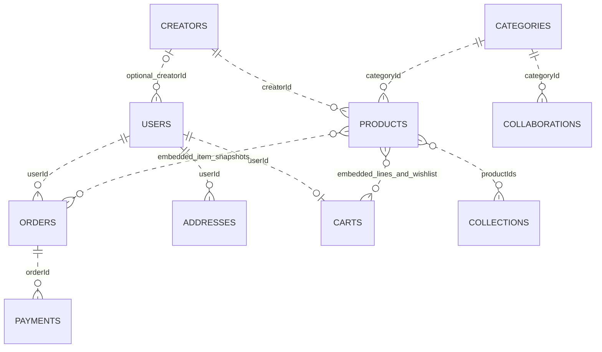
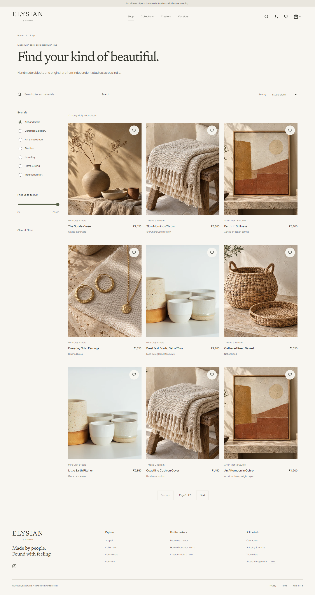
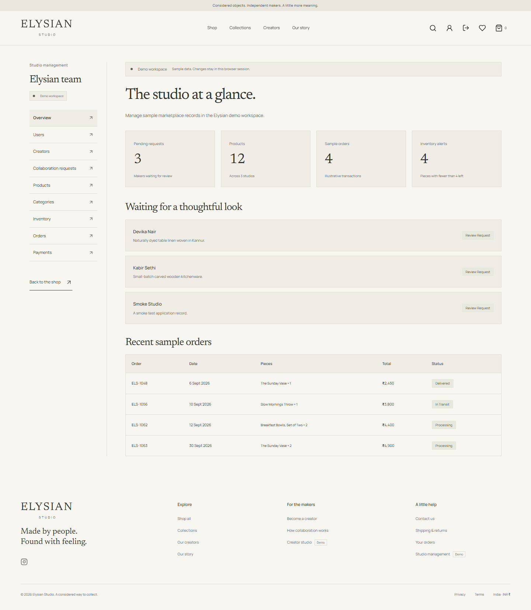

# Elysian Studio

## Handmade Marketplace and Creator Collaboration Platform

**Project category:** Database Systems Engineering project

**Documentation snapshot:** October 2, 2026
**Audience:** Expo evaluators, faculty, students and project maintainers

> **Crafted with Soul, Wrapped in Emotion**


### Contents

| Sections | Topics |
| --- | --- |
| 1-3 | Abstract, current status and problem statement |
| 4-6 | Objectives, users and implemented features |
| 7-9 | Stack, architecture and database design |
| 10-12 | Workflows, API and local setup |
| 13-15 | Verification, limitations and cloud/payment implementation status |
| 16-18 | Expo demonstration, rehearsal checklist and viva answers |
| 19-21 | Report structure, future work, conclusion and references |

## 1. Abstract

Elysian Studio is a full-stack demonstration of a handmade marketplace. It connects product discovery, customer shopping, creator product management and administrative oversight through a React interface, an Express REST API and MongoDB persistence.

Customers can browse products, manage a bag and wishlist, place simulated orders and view their account history. Creators can create and edit products and view orders containing their work. Administrators can inspect marketplace records, monitor low stock and review collaboration applications. The backend validates requests and checks authentication, roles and resource ownership.

The project demonstrates how interface actions become API requests and persistent database operations. Its catalogue and creator profiles are illustrative. Atlas migration and Razorpay sandbox integration code are implemented. A real sandbox checkout modal has opened, but a captured test payment and successful end-to-end finalisation have not yet been verified. Render is configured and deployment is pending; no live money collection is claimed.

## 2. Current Status: Built Versus Planned

| Capability | Status at this documentation snapshot |
| --- | --- |
| React storefront and responsive layouts | Implemented |
| Express REST API and request validation | Implemented |
| JWT authentication and bcrypt password hashing | Implemented |
| Customer, creator and admin role checks | Implemented |
| MongoDB persistence through Mongoose | Implemented; local data migrated to Atlas |
| Saved bags, wishlists, profiles, addresses and orders | Implemented in REST mode |
| Creator product creation and editing | Implemented |
| Collaboration submission and admin review | Implemented |
| Order creation, stock reduction and sample payment record | Implemented with simulated payment |
| Browser-only mock adapter | Implemented as an alternative mode |
| Public Render deployment | Single-service configuration ready; deployment pending |
| MongoDB Atlas migration | Ten original collections and 41 documents migrated and verified; backup and local source preserved |
| Razorpay sandbox integration | Implemented and tested with mocked provider calls against isolated MongoDB; real modal opened, captured-payment success not yet verified |
| INR 1 expo demo product with zero shipping | Added; cloud catalogue has 13 products |
| Three new private expo accounts | Created with fictional emails and strong passwords; cloud has six users |
| Real money collection | Outside the selected sandbox expo scope |

Update this table only after implementation and verification. Possessing a hosting account or payment Key ID does not establish a working integration.

## 3. Problem Statement

The project explores a marketplace in which the maker is visible alongside the product. A shopping interface alone does not demonstrate how catalogue information, stock, customer state, orders and creator applications stay connected.

Elysian Studio addresses this design problem through three role-specific workspaces that share the same backend and database. Its educational goal is to make the complete flow understandable: product discovery, authenticated actions, persistence, inventory updates and administrative review.

No customer survey, market-size study or measured commercial impact is claimed by this document.

## 4. Objectives

- Build a consistent storefront for discovering handmade products and creators.
- Provide customer, creator and admin workspaces with distinct permissions.
- Persist marketplace data rather than keeping all information in browser state.
- Validate requests on the server and enforce ownership of protected resources.
- Preserve purchased item names and prices in order snapshots.
- Demonstrate embedded documents, application references, indexes and aggregation.
- Handle stock checks and caught checkout failures in the local database setup.
- Keep presentation, service contracts, routes and persistence responsibilities separate.
- Support repeatable unit, integration and browser verification.

## 5. Users and Scope

| Role | Intended workflow | Important boundary |
| --- | --- | --- |
| Visitor | Browse products, collections and makers; build a local bag or wishlist | Anonymous saved state is device-local |
| Customer | Sign in, shop, place simulated orders and manage account data | Cannot access admin resources or another customer's protected records |
| Creator | Manage own products and profile; inspect relevant order lines | Must have a linked creator identity; cannot manage another creator's products |
| Admin | Inspect records, summaries, inventory and sample payments; review applications | Protected by backend role checks |

The current admin workspace should not be described as full CRUD for every entity. Many screens are record listings or summaries; collaboration review is an implemented write operation. Likewise, displaying order status does not imply integrated courier tracking.

## 6. Main Features

### Storefront and discovery

- Animated, skippable entrance and editorial homepage.
- Product catalogue with URL-based search, category and price filters, sorting and pagination.
- Product imagery, descriptions, materials, dimensions and stock-aware quantities.
- Curated collections, creator directory and creator profiles.
- Desktop and mobile layouts with loading, error and empty states.

### Customer workspace

- Registration, login and session-based account access.
- Bag and wishlist; anonymous state merges into signed-in saved state.
- Simulated checkout when gateway keys are absent; labelled Razorpay sandbox checkout when configured, plus confirmation and order history.
- Profile updates and reusable address management.
- Local creator-follow state; this is not cloud-synchronised.

### Creator workspace

- Overview of products, related orders and recorded sales totals.
- Product creation and editing, including active/draft status and stock.
- Profile editing and collaboration review status.
- Creator order views contain only that creator's matching lines and recomputed totals.

### Admin workspace

- Overview counts for products, creators, orders, pending applications and low stock.
- Views of users, creators, products, categories, inventory, orders and sample payments.
- Approval or decline of collaboration applications.
- Backend aggregation endpoints for marketplace summaries and creator revenue analysis.

Recorded sales and revenue are derived from order data, not confirmed bank settlement.

## 7. Technology Stack

| Layer | Technologies in this repository | Responsibility |
| --- | --- | --- |
| Frontend | React 19, TypeScript 5.8, Vite 6 | Pages, components and frontend build |
| Routing | React Router 7 | Navigation and role-protected routes |
| Styling | CSS Modules, shared design tokens, Manrope and Newsreader fonts, Lucide icons | Visual consistency and scoped styling |
| Backend | Express 5, Node.js, TypeScript, tsx | REST routing and application execution |
| Validation | Zod | Server-side request validation |
| Authentication | bcryptjs, jsonwebtoken | Password hashing and signed session tokens |
| Persistence | MongoDB, Mongoose 9 | Collections, schemas, indexes and database operations |
| Verification | ESLint, Vitest, Testing Library, Playwright, axe | Static checks, unit/integration tests and browser checks |

Node.js 22 is the repository's recommended runtime. The current Windows setup has recorded intermittent Vitest worker-startup failures on Node 26.

## 8. System Architecture

```text
React pages and components
          |
     Service API contract
          |
          +-- Mock adapter --> browser storage
          |
          +-- REST adapter --> HTTP /api requests
                                   |
                              Express routes
                                   |
                    Validation, authentication, ownership
                                   |
                          Backend store operations
                                   |
                             Mongoose models
                                   |
                                MongoDB
```

Components use the service layer instead of importing catalogue fixtures directly. This allows the frontend to use either mock or REST mode without replacing its pages. Shared domain interfaces retain the existing string identifiers across frontend, API and database responses.

Authentication middleware verifies bearer tokens and resolves the current user from the database. Routes check roles and ownership before protected operations. The backend store performs persistence work; components do not connect directly to MongoDB.

### Repository organisation

Repository root: `C:\2ND YEAR ODD SEM\PROJECTS\DBS\website`.

The following tree shows directories relative to that root:

```text
website/
  frontend/       React source, public assets, configs and browser tests
  backend/        Express routes, middleware, store and integration tests
  database/       Connection, Mongoose models, seed and inspection script
  docs/           Validation, asset provenance and project documentation
  PROJECT REVIEW/ Original project-review documents
  .context/       Project context and local verification records
  package.json    Shared dependency manifest and npm commands
```

There is one root dependency installation and lockfile. MongoDB's actual data files are outside this repository. The archived Phase 2 store is historical, not the active persistence layer.

## 9. Database Design

### Collections

| Collection | Main data | Relationships or design choice |
| --- | --- | --- |
| `users` | Identity, email, password hash, role, optional creator ID | Unique application ID and email |
| `creators` | Maker/studio profile and image paths | Referenced by products and creator accounts |
| `categories` | Category name, image and description | Referenced by products and applications |
| `products` | Price, images, description, stock and active/draft status | Creator and category string references |
| `collections` | Curated grouping and product ID array | Unique slug identifies a collection |
| `orders` | Buyer ID, date, total, status and embedded item snapshots | Each line retains name, quantity and unit price |
| `payments` | Order ID, amount, method and public payment status | Legacy demo records and sandbox-verified records retain the public `Recorded demo` status |
| `addresses` | User-owned reusable delivery details | Separate from orders |
| `collaborations` | Applicant name/email, category, description, status and date | Application may precede an account or creator profile |
| `carts` | User ID, embedded bag lines and wishlist product IDs | At most one saved-state document per user |
| `paymentattempts` | Internal gateway IDs, owner, totals and attempt state | Eleventh internal collection for sandbox finalisation and retry handling |

Inventory is stored in `products.stock`; there is no separate inventory collection. Wishlist IDs are stored in `carts`; there is no separate wishlist collection.

### Logical relationships



These are intended logical links, not database-enforced foreign keys. Relationships use application string IDs; the schemas do not declare Mongoose `ref` relationships. MongoDB also assigns top-level `_id` values, which are removed from API serialization. A creator can be linked to multiple users because `users.creatorId` is not unique.

### Why embed some data and reference other data?

- **Order items are embedded snapshots:** changing a product's name or price should not change the purchase record.
- **Cart lines are embedded:** a small user bag is generally retrieved and updated together.
- **Creator and category profiles are referenced:** products share those records instead of duplicating their complete contents.
- **Reusable addresses are separate:** account address management has its own ownership and lifecycle.

### Indexes and aggregation

Unique application keys prevent duplicate IDs, emails, collection slugs and saved-state user IDs. Additional indexes are declared for product creator/category/status, order ownership, payment order IDs, address ownership and collaboration status/email.

A product text index is declared, but catalogue filtering currently uses the shared JavaScript filtering helper, not MongoDB `$text` search. Do not claim every declared index accelerates the current search path.

Admin analysis uses aggregation stages such as `$facet`, `$unwind`, `$lookup`, `$group` and `$project`. Creator revenue multiplies stored line quantities by historical unit prices, while creator attribution uses the current product relationship. Deleted products or creators can therefore cause unmatched lines to be omitted.

## 10. End-to-End Workflows

### Authentication

1. A user registers or submits login credentials.
2. The backend validates the request and hashes or checks the password with bcrypt.
3. Successful authentication returns a JWT and user information.
4. The REST client attaches the token to subsequent protected requests.
5. Middleware verifies the token and resolves the current user.
6. Routes enforce the user's role and ownership where required.

Frontend route protection improves navigation, but backend checks provide the access-control boundary. The current browser session uses local storage; this is not a hardened cookie-based production session design.

### Shopping and current simulated checkout

1. The customer discovers an active product and selects an available quantity.
2. The bag stores product IDs and quantities. Signed-in state persists in MongoDB.
3. The customer signs in and supplies or selects delivery details.
4. The backend combines duplicate lines, validates quantities and loads current product data.
5. It constructs order lines and calculates the product subtotal on the server.
6. The demo payment provider returns a sample payment record; no money moves.
7. Stock is conditionally decremented only when sufficient active stock remains.
8. The order and sample payment are saved, and the signed-in bag is cleared.
9. The UI shows confirmation. Refresh the creator/admin views to retrieve new data.

On standalone MongoDB, legacy simulated checkout uses compensating rollback for caught persistence failures, not crash-safe ACID behaviour. Its process-local queue is not a distributed lock. Sandbox finalisation requires a transaction-capable database and has been tested on a temporary isolated MongoDB replica set with mocked provider calls.

### Implemented sandbox checkout

1. The authenticated customer requests a gateway order using server-priced items and shipping; the INR 1 expo-only product has zero shipping.
2. The browser opens Razorpay's labelled test checkout. No real money moves.
3. The backend checks the signature and fetches the payment to verify capture status, INR currency, exact paise amount, gateway order and owner.
4. Verification or a signed raw-body webhook finalises stock, order, payment and bag changes in a transaction. Duplicate finalisation is idempotent.
5. A captured payment that cannot be fulfilled records `reconciliation_required` without a successful order or partial stock changes.

These paths pass isolated integration tests. Opening the actual sandbox modal has been verified, but provider success/failure/pending flows and a captured test payment have not yet completed end-to-end verification.

### Creator product management

1. A linked creator account opens the product form.
2. The creator submits product fields, category, price, stock and image paths.
3. The backend checks role, product ownership and referenced creator/category existence.
4. A valid product is saved and can appear in the storefront when active.
5. Reloading retrieves the persisted record, rather than a form-only change.

There is no remote image-upload service. Products store image paths or URLs.

### Collaboration application and review

1. An applicant completes the collaboration form.
2. Server validation checks fields and category existence.
3. A collaboration record is persisted with `pending` status.
4. An admin reviews it and saves `approved` or `declined` status.
5. A signed-in user can retrieve the latest application associated with their email.

Approval updates application status only. It does not automatically create a creator profile, create credentials or promote a customer's role. Some submitted fields are validated but are not stored by the current collaboration schema.

## 11. REST API Overview

Paths below describe the implemented API, including sandbox payment endpoints.

| Method | Path | Purpose / access |
| --- | --- | --- |
| GET | `/api/health` | Service and database state |
| POST | `/api/auth/register`, `/api/auth/login` | Register or authenticate |
| GET | `/api/auth/me` | Resolve authenticated session |
| GET | `/api/products` | Public filtered catalogue |
| GET | `/api/products/:id`, `/api/products/:id/related` | Product and related items |
| GET | `/api/products/manage` | Creator-owned or admin product records |
| POST | `/api/products` | Creator/admin product save |
| GET | `/api/categories`, `/api/creators`, `/api/collections` | Public discovery data |
| PATCH | `/api/creators/:id` | Owner/admin profile update |
| GET/POST/PATCH/DELETE | `/api/cart` and item subpaths | Authenticated bag operations |
| GET/PUT | `/api/wishlist` | Authenticated wishlist |
| GET/POST | `/api/orders` | Authorised order views or simulated checkout |
| GET | `/api/orders/:id` | Authorised single-order view |
| GET/PATCH | `/api/users`, `/api/users/me` | Admin listing or own profile update |
| GET/PUT/DELETE | `/api/users/me/addresses` and ID subpaths | Own address management |
| POST | `/api/collaborations` | Public application submission |
| GET | `/api/collaborations/me` | Own latest application |
| GET/PATCH | `/api/collaborations` and ID subpaths | Admin listing and review |
| GET | `/api/payments` | Admin sample-payment listing |
| GET | `/api/payments/config` | Public sandbox availability; no secrets returned |
| POST | `/api/payments/orders` | Authenticated, server-priced sandbox gateway order |
| POST | `/api/payments/verify` | Authenticated payment verification and finalisation |
| GET | `/api/payments/attempts/:id` | Owner/admin attempt status |
| POST | `/api/payments/webhook` | Signed webhook; raw body parsed before JSON middleware |
| GET | `/api/admin/summary`, `/api/admin/analytics` | Admin aggregation results |

`GET /api/payments` remains an admin record listing, not a charge endpoint. Legacy `POST /api/orders` rejects simulated checkout when gateway keys are configured. Unauthenticated protected requests return `401`; forbidden role/ownership requests return `403` where applicable. Unknown API routes return JSON `404`; health returns `200` only while the database is connected, otherwise `503`.

## 12. Local Setup and Commands

Run commands from `C:\2ND YEAR ODD SEM\PROJECTS\DBS\website`.

### Prerequisites

- Repository files, Node.js 22 and npm.
- Configured local MongoDB or Atlas for REST mode; local MongoDB for isolated backend tests.
- Browser; MongoDB Compass is useful for the database demonstration.
- Playwright Chromium installed if browser tests will be run.

### First-time setup

```powershell
Set-Location 'C:\2ND YEAR ODD SEM\PROJECTS\DBS\website'
npm ci --include=dev
if (-not (Test-Path 'frontend/.env.local')) {
    Copy-Item 'frontend/.env.example' 'frontend/.env.local'
}
if (-not (Test-Path 'backend/.env')) {
    Copy-Item 'backend/.env.example' 'backend/.env'
}
```

Configure `VITE_API_MODE=rest` in the frontend environment. In the backend, set `MONGODB_URI` to the intended database and configure a private `JWT_SECRET`; production rejects the development fallback and secrets shorter than 32 characters. Optional Razorpay key ID/secret must be configured together and only `rzp_test_` keys are accepted; the webhook secret stays server-side. Local ports are normally frontend `5173`, API `4000` and MongoDB `27017`.

`NODE_ENV=production` is set on the current machine. Keep `--include=dev` when installing so build and test tools are not omitted. Do not overwrite existing private environment files.

### Start the current application

Keep MongoDB running, then:

```powershell
npm run dev:all
```

The local storefront normally opens at `http://localhost:5173`; health is available at `http://localhost:4000/api/health`. Use the actual port reported by Vite if its default is occupied. Mock mode requires only the frontend, but stores demo state in the browser rather than the shared database.

### Useful commands

| Command | Purpose |
| --- | --- |
| `npm run typecheck` | Frontend and backend/database TypeScript checks |
| `npm run lint` | ESLint checks |
| `npm test` | Unit and backend integration tests |
| `npm run test:frontend` | Frontend tests only |
| `npm run test:backend` | Backend tests; MongoDB required |
| `npm run test:e2e` | Isolated browser integration suite |
| `npm run build` | Frontend build into the frontend distribution directory |
| `npm start` | Express API and built frontend on one origin; build first |
| `npm run preview` | Local frontend build preview; API still needed in REST mode |
| `npm run db:inspect` | Read-only database counts and topology |
| `npm run db:migrate:expo` | Explicit guarded migration; not a seed or routine startup command |
| `npm run db:prepare:expo` | Explicit expo product/account preparation; not a reset command |

The explicit seed command is `npm run seed`. It deletes application data in all ten collections of the configured database before writing fixtures. Use it only for an intentionally disposable/reset database, never as a routine startup or migration step.

Atlas migration and expo preparation are already complete for this snapshot. Do not rerun them to reset a rehearsal. Review their safety checks and confirm source/target intent before any deliberate rerun; preserve the backup and local source.

Unit integration tests use isolated test databases. Browser tests use `elysian_e2e`, API port `4001` and frontend port `5174`. A single-worker diagnostic command is `npm test -- --maxWorkers=1 --no-file-parallelism`.

## 13. Verification Evidence

The current results below were reported by the implementation lead on October 2, 2026. This documentation edit did not rerun tests or access private environments.

| Evidence | Recorded result | Qualification |
| --- | --- | --- |
| September 30, 2026 reorganisation | Typecheck, lint and frontend build passed | Reported in repository validation records |
| Current unit/integration suite | 198 tests passed | Payment provider calls mocked; payment transaction tests use real isolated MongoDB |
| Current static checks and build | Typecheck, lint and frontend build passed | Current implementation verification |
| Current browser suite | 24 of 25 passed; the failed desktop assertion passed a focused one-test retry | Not one uninterrupted 25/25 green run |
| Atlas migration | Ten original collections, 41 documents verified | Backup and local source preserved; cloud preparation brings catalogue/users to 13/six |
| Real Razorpay sandbox browser check | Actual checkout modal opened | No captured test payment or successful finalisation verified yet |
| Render | Single free web service configured | Deployment and public availability pending |
| Focused REST browser flows | Bag merge, persistence, wishlist and account isolation passed | Historical focused runs |
| Earlier expo-readiness inspection | Lint, backend/database typecheck and read-only database inspection passed | No fresh browser checkout performed |
| Earlier build attempts | Tool timed out after 30 seconds | Superseded by the current successful build; retained as historical context |

The earlier local inspection observed ten collections, twelve products, six categories, three creators, three users and four orders. The verified migration copied 41 documents in those ten collections; cloud expo preparation then added one product and three users. `paymentattempts` is an additional internal collection. Counts are snapshot evidence, not commercial metrics.

See `C:\2ND YEAR ODD SEM\PROJECTS\DBS\website\docs\VALIDATION.md` for the recorded history. Its older frontend-only subsection predates the backend and should not be read as the current system description.

No performance benchmark, uptime guarantee, complete security audit or live-payment certification is claimed.

## 14. Known Limitations and Required Corrections

1. **Actual sandbox finalisation remains unverified.** Gateway calls, signature verification and signed webhook handling are implemented. Isolated tests pass and the real modal opened, but no captured provider payment has yet produced a verified end-to-end success.
2. **Totals are aligned in code and tests, not yet through a captured provider payment.** Shared shipping rules and server-calculated paise include zero shipping for the expo-only product; complete the actual sandbox rehearsal before claiming provider success.
3. **Delivery details are not an order snapshot.** Checkout validates an address, but the order schema does not store that address or an address ID. Separate saved addresses do not solve historical order delivery tracking.
4. **Legacy local compensation is not crash-safe.** Standalone rollback handles caught failures but can fail or expose intermediate changes. Sandbox transactions pass isolated replica-set tests; deployed-provider verification remains pending.
5. **Multi-process scaling needs review.** The checkout queue and sequential application-ID generation are not distributed coordination mechanisms.
6. **Policies describe an educational demo.** Information-page copy was updated for REST persistence and sandbox use; this is not reviewed commercial legal or privacy compliance.
7. **No complete creator onboarding automation.** Application approval does not provision accounts, link a profile or change roles automatically.
8. **No real delivery, email, refunds or remote uploads.** Displayed order statuses and image fields do not establish those integrations.
9. **Search is suitable for the demo, not proven at scale.** Current filtering loads data for shared application-side processing.
10. **Public deployment is pending.** Cloud seeded login hashes were rotated, private expo accounts created, and production JWT/sandbox guards and basic auth rate limits added. Token handling, cloud permissions and abuse protection still require operational review; these changes are not a full security audit.
11. **Entrance accessibility exception.** The entrance animation intentionally plays even with reduced motion enabled; it can be skipped. Do not claim every animation respects reduced motion.

These boundaries are part of an honest engineering presentation, not evidence that every workflow is unfinished.

## 15. Expo Implementation: Render, Atlas and Razorpay Sandbox

**Atlas migration, expo preparation, hosting code and sandbox integration are implemented. Render deployment and an actual captured sandbox payment remain pending.**

```text
Visitor browser
      |
Render web service: built React assets + Express API
      |
      +-- MongoDB Atlas: persistent marketplace data
      |
      +-- Razorpay test environment: sandbox checkout
```

### Hosting configuration

`render.yaml` configures one free Render web service. Express serves the built React assets and relative `/api` requests on one origin, including browser-route refresh fallback while missing assets return `404`. `.node-version` pins Node 22.22.0. Build is `npm ci --include=dev && npm run build`; start is `npm start`.

The configuration uses private/generated environment secrets, `/api/health` and the host-provided port. Public deployment has not yet been verified independently of the team's laptop. Free Render services can sleep after fifteen idle minutes and have an ephemeral filesystem; do not describe that tier as continuously warm or use it to store MongoDB data. Provider reference: [1] in Section 21.

### Completed cloud migration

The separate Atlas expo database received all ten original collections and 41 documents without reseeding. Migration verification passed, and the backup and local source were preserved. Expo preparation added the INR 1 product and three private role accounts, bringing cloud products to 13 and users to six. The sandbox flow adds the internal `paymentattempts` collection. Hosted network access and deployment-specific persistence still need final verification. Provider reference: [2] in Section 21.

### Implemented sandbox payment paths

- A clearly labelled INR 1 demo product has zero shipping for expo-only checkout.
- Test mode must say that no real money is charged; it is not a bank-debit demonstration. Provider reference: [3] in Section 21.
- Backend-created gateway orders use the server-calculated amount in paise.
- The backend verifies signature, amount, currency, ownership, gateway order and capture status before finalisation. Provider reference: [4] in Section 21.
- Signed raw-body webhooks and idempotent finalisation support retry recovery; captured stock failures persist `reconciliation_required`.
- Gateway identifiers and attempt states are stored separately from public domain shapes.
- Mocked provider tests cover finalisation and rejection/retry paths on isolated MongoDB. Real provider success, failure and pending flows remain to be rehearsed; opening the real modal is not payment completion.

The public `Payment` status remains `Recorded demo`; the method distinguishes sandbox-verified records. Internal attempt states are `pending`, `completed` and `reconciliation_required`. No captured real-provider success is claimed in this snapshot.

### Credentials and private expo accounts

Keep provider secrets and database credentials server-side, outside Git and the client bundle. Do not include actual credentials in this document. Revoke any exposed hosting token before deployment.

Three private accounts with fictional emails, strong separate passwords and explicit roles were created; the creator account is linked to the product's creator. Their private handoff is the ignored `backend/.env.expo-accounts` file, never this document. Cloud seeded login hashes were rotated; the local source remains intact. Do not publish emails/passwords from the private handoff or show it during the expo.

### Acceptance checks before claiming completion

- [ ] Render website opens over HTTPS on mobile data with local servers stopped.
- [ ] Direct navigation and refresh work on product and dashboard routes.
- [ ] Data persists across browser sessions and hosting restarts.
- [ ] Backend checks prevent unauthorised role and ownership access.
- [ ] UI total, backend total and gateway amount agree.
- [ ] Sandbox success produces one verified attempt and one finalised order.
- [ ] Failure/cancellation does not create a successful order or consume stock permanently.
- [ ] Repeated callbacks/webhooks do not duplicate orders or stock changes.
- [ ] An interrupted successful payment can be reconciled.
- [ ] No secrets or working privileged passwords are exposed in public files.
- [ ] Fresh tests and a full rehearsal support the final status table.

## 16. Expo Presentation: Six-Minute Demonstration

Use a rehearsed local demo unless deployment has passed its acceptance checks. Sandbox keys disable legacy simulated checkout, so choose the intended mode beforehand. The actual modal opened, but do not present captured-payment success until that flow has been verified.

| Time | Action | Point to explain |
| --- | --- | --- |
| 0:00-0:30 | Open homepage and briefly show the entrance | Problem, target users and project purpose |
| 0:30-2:00 | Customer: find a product, bag, simulated checkout | Complete customer journey |
| 2:00-3:00 | Creator: refresh matching orders and show products | Creator ownership and persisted data |
| 3:00-4:00 | Admin: refresh order view and show low-stock/application review | Shared records and oversight |
| 4:00-5:30 | Show architecture, logical ER diagram and one MongoDB order | Backend and database evidence |
| 5:30-6:00 | State boundaries and next steps | Honest technical conclusion |

### Opening script

> Good morning. Our project is Elysian Studio, a handmade marketplace demonstration with customer, creator and administrator workspaces. We built it to show how discovery, shopping, product management and application review connect through a REST API and MongoDB. We will demonstrate one order and follow it from the customer interface to the database and relevant dashboards.

### The order demonstration

1. Choose a stocked product belonging to the creator account used in the demo.
2. Sign in as the customer, purchase one unit through the current simulated checkout and note the order ID.
3. Show that order in customer history.
4. Refresh the creator order view and identify the matching line.
5. Refresh the admin order view and locate the same order ID.
6. In Compass, find the matching order document and inspect the product stock.
7. Explain that the order's name and price are stored snapshots.

Use separate browser profiles or different browsers for independent role sessions. Ordinary tabs share local storage. Avoid exposing password hashes, secrets, tokens or personal addresses while showing database records.

Current-payment statement:

> This checkout records an order and a simulated payment. No money is charged.

For the implemented sandbox mode, state its current evidence boundary:

> This checkout opens Razorpay's test environment. Verification and finalisation pass isolated tests, but an actual captured test-payment success has not yet been verified. No real money moves.

### Closing script

> The project demonstrates a connected marketplace rather than isolated screens: customer actions reach the API, update persistent records and become visible to the relevant roles. Atlas migration and sandbox integration code are complete. Public deployment and actual captured-payment verification remain pending, and legacy standalone checkout has reliability limits.

## 17. Rehearsal and Backup Checklist

- [ ] Confirm the correct REST/mock mode and database before rehearsal.
- [ ] Verify local MongoDB, API and frontend startup.
- [ ] Check the chosen product's creator and stock; rehearsals reduce stock.
- [ ] Test all three role logins in separate browser sessions.
- [ ] Rehearse the same order across customer, creator, admin and database views.
- [ ] Keep the architecture and ER diagram readable on the presentation display.
- [ ] Record a short backup demo and save screenshots/slides locally.
- [ ] Bring charger and display adapter; disable distracting notifications.
- [ ] Do not reset the database just to restore a demo without explicit intent.
- [ ] If cloud deployment is completed, test it on mobile data with local servers stopped.
- [ ] Prepare a QR poster only after confirming the actual public address.
- [ ] Freeze unrelated feature work after the final rehearsal.

For three presenters, split the opening/customer journey, creator/admin views and database explanation. Everyone should understand the whole flow and truthfully describe their own contributions.

## 18. Viva Questions and Suggested Answers

### Is this only a frontend website?

No. REST mode uses Express routes, authentication middleware and Mongoose-backed MongoDB operations. A separate mock mode exists for browser-only demonstration.

### Why MongoDB?

It fits this project's document-oriented design: image arrays, embedded bag lines and order snapshots can be stored together. We still use schemas and validation. This is a project-specific choice, not a claim that MongoDB is always better than a relational database.

### How are entities related without SQL foreign keys?

Records use stable application string IDs. Routes validate some referenced entities, and operations apply ownership rules. MongoDB does not enforce the project's logical foreign-key links; complete referential integrity is an application responsibility.

### Is the database normalised?

It deliberately mixes references and embedding rather than claiming strict SQL normal forms. Shared profiles are separate, while order lines copy the values needed to preserve purchase history.

### How are passwords protected?

REST authentication uses bcrypt hashes. Normal user queries and serialization exclude password hashes. This does not mean passwords are encrypted or that the application has passed a complete security audit.

### Why JWT and role checks?

JWTs let the backend verify a signed identity claim. Middleware then resolves the current user and routes check roles and ownership. The UI hiding a page is not sufficient protection by itself.

### How do you avoid stock going negative?

Checkout uses conditional updates matching active products with sufficient stock before decrementing. It also queues checkouts within one API process. This does not provide all guarantees required for distributed multi-instance operation.

### Is checkout a transaction?

Legacy simulated checkout on standalone MongoDB uses compensation, not a crash-safe transaction. Sandbox finalisation requires transaction-capable MongoDB and passes isolated replica-set integration tests with mocked provider calls. Actual provider and deployed end-to-end verification remain pending.

### Does payment actually charge a bank account?

No. Razorpay sandbox integration is implemented, but test mode does not move real money. The actual modal opened; a captured test payment has not yet been verified. This is not live payment collection.

### Can the creator see every customer's entire order?

The creator order view is authorised for the linked creator and filters to matching product lines, recomputing that creator's total. Admin and customer views have different access rules.

### What happens when an application is approved?

Its saved status changes. Automatic account/profile provisioning and role promotion are not implemented by that operation.

### Will the planned site work without your laptop?

That remains a deployment acceptance condition, not a completed claim. Atlas data migration is verified and Render is configured, but public deployment must still be tested with local servers stopped.

### What did testing prove?

The current 198 passing unit/integration tests exercise frontend behaviour, API access, persistence, hosting and mocked-provider sandbox transaction paths on isolated MongoDB. Typecheck, lint and build pass. Browser coverage is 24/25 plus one passing focused retry, not a full green single run. These checks do not establish captured provider payment success, public deployment, unlimited scale or complete security.

## 19. Suggested Expo Report Structure

This README can be adapted into the technical content of a printed report. Use these chapters:

1. Title page and genuine team/faculty details.
2. Abstract, problem statement and objectives.
3. Project scope and role-based requirements.
4. Technology stack and system architecture.
5. Database collections, logical ER diagram and schema decisions.
6. Module implementation and end-to-end workflows.
7. Screenshots showing storefront, product, creator and admin views.
8. Verification evidence and demonstrated results.
9. Limitations, planned deployment and future work.
10. Conclusion and references.

Team names, institution, department, guide, contribution percentages and final hosting address have not been supplied. They are deliberately not invented here. Add verified details on the report cover rather than including fake names or a fabricated live URL.

Saved screenshots illustrate the interface, not proof of deployment:





## 20. Future Work and Conclusion

### Remaining expo verification

Atlas migration, three private role accounts, the INR 1 sandbox product, consistent totals, production route serving and sandbox integration code are implemented. Remaining work is Render deployment, a captured test payment traced through finalisation and dashboards, actual provider failure/pending rehearsals and a full browser-suite/rehearsal pass. Deployment evidence belongs in the separately maintained `docs/EXPO_DEPLOYMENT.md`.

### Later production work

- Activated live merchant payments, refunds and payment reconciliation.
- Durable order delivery-address snapshots and fulfilment workflows.
- Secure remote uploads and verified transactional email.
- Explicit creator account/profile provisioning and review policy.
- Database-side search/pagination and suitable compound indexes.
- Distributed-safe identifiers, concurrency controls and operational monitoring.
- Backup/restore verification, audit logging and reviewed privacy/security policies.

These are future directions, not features already present.

### Conclusion

Elysian Studio demonstrates the connection between a role-based marketplace interface and persistent database operations. Its strongest expo evidence is a single order traced through the customer view, relevant creator lines, admin records and MongoDB. The project also provides concrete examples of snapshots, embedded data, references, indexed records and aggregation.

Present the actual working build and state the payment and deployment evidence boundaries clearly. Do not treat an opened modal or passing mocked-provider tests as a captured provider payment.

## 21. References and Evidence Sources

### Repository sources

| Source | Absolute path |
| --- | --- |
| Main setup and project README | `C:\2ND YEAR ODD SEM\PROJECTS\DBS\website\README.md` |
| Shared domain interfaces | `C:\2ND YEAR ODD SEM\PROJECTS\DBS\website\frontend\src\types\domain.ts` |
| Service contract | `C:\2ND YEAR ODD SEM\PROJECTS\DBS\website\frontend\src\services\api.ts` |
| Routes and backend startup | `C:\2ND YEAR ODD SEM\PROJECTS\DBS\website\backend\src\index.ts` |
| Database operations and checkout | `C:\2ND YEAR ODD SEM\PROJECTS\DBS\website\backend\src\store.ts` |
| Collection schemas and consistency notes | `C:\2ND YEAR ODD SEM\PROJECTS\DBS\website\database\README.md` |
| Historical validation results | `C:\2ND YEAR ODD SEM\PROJECTS\DBS\website\docs\VALIDATION.md` |
| Image/font provenance | `C:\2ND YEAR ODD SEM\PROJECTS\DBS\website\docs\assets\ASSETS.md` |
| Current project context | `C:\2ND YEAR ODD SEM\PROJECTS\DBS\website\.context\activeContext.md` |

### Official provider documentation

Consulted for the implemented extension; provider limits and requirements can change. Addresses are listed for report citation, not evidence that deployment or captured-payment verification is complete.

[1] Render, Deploy for Free:

```text
https://render.com/docs/free
```

[2] MongoDB, Integrate with Render:

```text
https://www.mongodb.com/docs/atlas/reference/partner-integrations/render/
```

[3] Razorpay, Test and Live Modes:

```text
https://razorpay.com/docs/payments/dashboard/test-live-modes/
```

[4] Razorpay, Standard Checkout Integration Steps:

```text
https://razorpay.com/docs/payments/payment-gateway/web-integration/standard/integration-steps/
```

The sample catalogue and creators are fictional. Do not treat them as verified businesses, customers or commercial transactions. Asset-specific provenance applies; the repository does not declare a project-wide open-source licence.