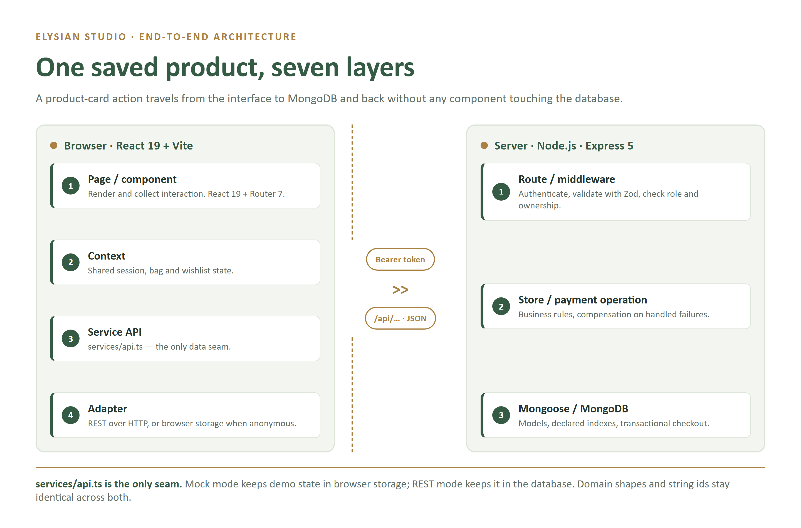

# ELYSIAN STUDIO
## Handmade Marketplace & Creator Collaboration Platform
### Jury Presentation & Viva Guide

**Database Systems Engineering and Distributed Backend Development | 25CS1302E**

**Team:** R. Vishnu Vardhan (2520090166), K. Amruthavalli (2520090070), B. Akshitha (2520090014)

**Section 13 | Team 11** — details taken from the submitted abstract and project-review PDFs.

**Prepared: October 3, 2026**

Crafted with Soul, Wrapped in Emotion


### How to use this guide today
- Read sections 01–02 first: they contain your revision sheet and opening speech.
- Rehearse section 16's demo. Use sections 17–19 for viva practice.
- Use the database and workflow sections when the jury asks how the system works internally.
- Speak about the current implementation, not every feature mentioned in the initial proposal.

**Evidence boundary:** This guide describes inspected local source. The latest local frontend suite has 133 passing tests; typechecks, lint and production build passed. Backend integration, browser end-to-end and deployment checks were not rerun during this guide preparation. Older cloud/payment results are labeled historical evidence.

---PAGE---
# 01 | Last-Minute Revision Sheet
## The project in one sentence
Elysian Studio is a database-driven handmade marketplace where customers discover and order products, creators manage their own work, and administrators review creator applications and inspect marketplace records.

## The six answers you should know without notes
| Question | Your short answer |
| --- | --- |
| What problem do you address? | Product, creator, customer, stock, order and application information is connected in one marketplace instead of being managed separately. |
| What is the implemented stack? | React 19, TypeScript, Vite, React Router; Node.js with Express 5; MongoDB with Mongoose 9. |
| What are the user roles? | Customer, creator and admin. Visitors can browse and keep a device-local bag/wishlist. |
| What makes it a DBS project? | Structured schemas, embedded order/cart lines, application references, indexes, aggregation, ownership and transaction-aware operations. |
| How is access protected? | JWT authentication, current-user lookup, server-side role/ownership checks, Zod validation and bcrypt password hashing. |
| Are payments real? | A simulated path and a Razorpay sandbox path exist. Sandbox is test mode; do not claim live money collection. |

## Remember these three flows
**Shopping:** React action → service adapter → REST API → validation/authentication → store/payment operation → Mongoose → MongoDB → response → UI.

**Creator onboarding:** Sign in as customer → apply → admin review → database transaction creates/reuses creator profile, links account and approves application → refresh account session/UI.

**Sandbox checkout:** Server prices items → creates PaymentAttempt → gateway test checkout → server verifies signature and captured payment → transaction records order/payment and updates stock/cart.

## Corrections that protect your credibility
- The original abstract proposed MySQL. The implemented database is MongoDB. Explain this openly; do not say both are active.
- There are eleven model-backed collections in current source: ten core marketplace models plus PaymentAttempt.
- Inventory is a field on Product, not a separate active Inventory collection.
- Wishlist is stored in the Cart document; preferences are embedded in User.
- An admin listing screen is not automatically full CRUD. An order-status label is not live courier tracking.
- New local fixes are not proof that the deployed site already contains them.

**If you forget an answer:** Return to the data flow. Explain who performs the action, what the server validates, which document changes and what the user sees.

---PAGE---
# 02 | Opening Speech & Presentation Order
## Ready-to-speak opening: about 90 seconds
Good morning, respected jury. Our project is Elysian Studio, a handmade marketplace and creator collaboration platform.

The problem we chose is how to connect handmade products, their makers and customer orders in one organized system. A storefront alone is not enough: product information, available stock, user accounts, creator applications and payments must remain consistent behind the interface.

Our solution has three workspaces. Customers can discover products and creators, save items, manage their bag and account, and place orders. Creators can manage their own products and profile and view relevant order lines. Administrators can review creator applications and inspect products, inventory, orders and payment records.

We built the frontend with React and TypeScript, the REST API with Node.js and Express, and persistence with MongoDB through Mongoose. Although the initial abstract proposed MySQL, the actual implementation uses document schemas with embedded cart and order items and references between shared entities.

The important backend features are server-side validation, role and ownership checks, stock-aware checkout, historical order snapshots and transaction-based creator approval. We also have a Razorpay test-mode checkout path; we do not claim live payment processing.

I will first demonstrate the customer journey, then explain the database and API flow, and finally show the creator and administrative workflows.

## Suggested speaking order
| Time | Topic | What the jury should understand |
| --- | --- | --- |
| 0:00–1:30 | Problem, solution and stack | Why the project exists and what was built. |
| 1:30–4:00 | Customer demo | Actions produce persistent account and order data. |
| 4:00–5:30 | Architecture and database | Frontend, API and database responsibilities are separate. |
| 5:30–7:00 | Creator and admin | Permissions and approval are actual backend workflows. |
| 7:00–8:00 | Safety, testing, limitations | You understand correctness and the scope of the demo. |

## Team handoff suggestion
Split the presentation by topic only if it matches your actual contributions: customer/UI flow, backend/security/payment flow, and database/admin flow. Do not invent who wrote a module. Each teammate should be able to explain the entire request-to-database path.

## Closing sentence
Elysian Studio demonstrates how a marketplace interface connects to a structured database, with clear ownership, persistent user state and controlled workflows. Our next work is production hardening and completing validation of the exact release build.

---PAGE---
# 03 | Problem, Objectives & Scope
## Problem statement
The original project proposal identifies two connected needs: independent creators need a place to showcase handmade products, and customers need a convenient way to discover those products. Managing creators, products, stock, orders, payments and applications separately makes their relationships harder to maintain.

This is the project's design motivation. It is not a claim supported by a customer survey or measured commercial impact.

## Proposed solution
A centralized marketplace with role-specific interfaces sharing the same API and database. A customer action is not just a screen animation: it creates a validated request and, in REST mode, a persistent database operation.

## Main objectives
1. Make products and maker profiles discoverable through catalogue, category and collection pages.
2. Support customer shopping and account data that survive reloads in REST mode.
3. Limit creators to their own products and profile.
4. Keep creator applications separate from approval and privileged access.
5. Check stock and compute checkout prices on the server.
6. Preserve historical purchase names and prices in embedded order snapshots.
7. Demonstrate schemas, indexes, references, aggregation and consistency controls.
8. Keep the UI independent of the selected mock or REST data adapter.

## Existing approach versus this project
| Separate/manual approach | Elysian Studio approach |
| --- | --- |
| Product and maker information maintained independently | Products link to creator and category IDs. |
| Customer saved items exist only as temporary UI state | Signed-in bags and wishlists persist through the API. |
| Applying may be confused with becoming a creator | Application is pending until an authorized review grants access. |
| Current product prices can change purchase history | Orders store purchased names and unit prices. |
| Frontend restrictions treated as security | Backend checks authentication, role and ownership. |

## Implemented scope versus future scope
The implementation is an educational marketplace with illustrative catalogue data and sandbox/sample payments. It is not a commercial seller-settlement system. Live payouts, refunds, courier integration, automated email delivery and measured large-scale performance are not established features.

**Jury explanation:** “Our contribution is connecting shopping, creator onboarding and administrative review to a consistent data model. We are not claiming a replacement for every function of a commercial marketplace.”

---PAGE---
# 04 | Users, Features & Screen Map
| Workspace | Implemented capabilities | Access boundary |
| --- | --- | --- |
| Visitor | Home, shop, filters, product detail, collections, creator directory/profile; local bag/wishlist | Public catalogue; no account history or management privileges. |
| Customer | Login/register, saved bag/wishlist, checkout, orders, profile, addresses, preference choices, creator application | Own protected records only. |
| Creator | Product creation/editing, own profile management, relevant order lines, collaboration status | Linked creator identity; cannot edit another maker's products. |
| Admin | Listings for users/creators/products/categories/orders/payments; stock and summary views; collaboration decisions | API endpoints require admin role. Not full CRUD for every listed entity. |

## Useful browser routes
| Route | Purpose |
| --- | --- |
| / | Editorial homepage and entrance. |
| /shop | Search, filter, sort and paginate active products. |
| /products/:productId | Images, product information, quantity, add-to-bag. |
| /collections and /collections/:collectionSlug | Curated product groupings. |
| /creators and /creators/:creatorId | Maker discovery and profile. |
| /login and /register | Authentication. |
| /cart and /checkout | Shopping bag and checkout flow. |
| /account/* | Protected customer account sections. |
| /become-a-creator | Application page; submitting requires authentication. |
| /creator-dashboard/* | Creator/admin protected workspace. |
| /admin/* | Admin protected workspace. |

## Interface details worth showing
Responsive layouts, product imagery, scoped CSS styles, locally bundled fonts, loading/error/empty states and stock-aware quantities. Most routes are lazy-loaded. Do not spend the entire presentation on animation: show what happens to data.

**Say:** “The interface changes by role, but permission checks also happen on the server. Hiding a button is not our security boundary.”

---PAGE---
# 05 | Technology Stack & Why It Fits
| Layer | Actual tools | Responsibility |
| --- | --- | --- |
| UI | React 19 + TypeScript | Components, forms, typed data and state. |
| Navigation/build | React Router 7 + Vite 6 | Client routes, lazy bundles, development and production build. |
| Styling | CSS Modules + design tokens | Scoped styles and consistent colors/spacing; Manrope/Newsreader fonts and Lucide icons. |
| Runtime/API | Node.js + Express 5 | REST routes, middleware and request handling. |
| Input validation | Zod | Strict request shape and field checks before writes. |
| Authentication | bcryptjs + jsonwebtoken | Password hashes and signed expiring JWTs. |
| Persistence | MongoDB + Mongoose 9 | Documents, schemas, indexes, queries, aggregation and supported transactions. |
| Payment integration | Server HTTP calls + Razorpay checkout client | Sandbox order creation, verification and reconciliation. |
| Verification | TypeScript, ESLint, Vitest, Testing Library, Playwright, axe | Static checks, unit/integration/browser/accessibility checks. |

## Why these choices are defensible
React suits reusable product cards, forms and role-specific pages. TypeScript makes service interfaces explicit, although types alone do not validate an incoming network request. Express keeps endpoints and middleware visible. Mongoose adds structure to document storage; MongoDB is not being used as an unvalidated JSON bucket.

Order/cart items are read as part of their parent, so embedding is useful. Creator/category profiles are shared, so products reference them. This is a workload-based design explanation, not a claim that MongoDB is always better or faster than SQL.

## Important viva: “Your abstract said MySQL. Why MongoDB?”
“MySQL was our initial proposed stack. During implementation we used MongoDB with Mongoose. The current source has document schemas, embedded cart and order lines, indexed application IDs and aggregation pipelines. A relational design would also be valid, but it is not the database running in this implementation. We should update the final report to match the built system.”

## What “MERN” means here
MongoDB, Express, React and Node.js. TypeScript adds typed source code across the application. Vite is the frontend development/build tool, not the database or the production API server.

---PAGE---
# 06 | End-to-End Architecture


## Follow one action: “Save this product”
1. The product-card action calls the Studio context/service API.
2. The service boundary selects mock or REST behavior.
3. REST mode sends a request through the HTTP helper; a signed-in request carries a Bearer token.
4. Express authenticates and validates the request. The saved-state route derives the owner from the authenticated user.
5. The store updates the wishlist array in that user's Cart document through Mongoose.
6. The response confirms saved state. The UI keeps the confirmed list or rolls back a failed optimistic update.

## Responsibilities by layer
- **Page/component:** Render and collect interaction; do not access MongoDB or import raw catalogue data directly.
- **Context:** Coordinate shared user/cart/wishlist state and session-aware asynchronous behavior.
- **Service API:** Stable names and domain shapes; select mock/REST adapter.
- **HTTP adapter:** Translate service operations into endpoints and translate API errors.
- **Route/middleware:** Authenticate, validate input and enforce role/ownership.
- **Store/payment operation:** Apply business rules and coordinate persistence.
- **Mongoose/MongoDB:** Validate model writes, use indexes and perform database operations.

## Mock mode versus REST mode
Mock mode keeps demo behavior in browser storage. REST mode uses the Express API and database, with device-local fallback for anonymous shopping. They share domain contracts, not equivalent security guarantees. The browser-only mock is a demonstration mode, not a secure multi-user backend.

**Design strength:** Components use the service layer. Replacing storage does not require rewriting every product card or account screen. String IDs and response shapes remain stable across layers.

---PAGE---
# 07 | Database Design: Eleven Collections
| Collection / model | Main information | Why it is separate or embedded |
| --- | --- | --- |
| users / User | id, name, email, passwordHash, role, optional creatorId, preferences | Account identity; preferences embedded and exposed through a dedicated own-account endpoint. |
| creators / Creator | id, name, studio, specialty, location, bio, images, since | Reusable public maker profile. |
| categories / Category | id, name, image, description | Shared classification. |
| products / Product | id, creatorId, categoryId, price, images, stock, status, descriptive fields | Catalogue and inventory; status is active or draft. |
| collections / Collection | slug, descriptive fields, productIds | Curated many-product grouping. |
| orders / Order | id, userId, date, embedded items, total, status | Historical purchase with item name/unit-price snapshots. |
| payments / Payment | id, orderId, amount, method, status | Recorded marketplace payment linked to an order. |
| addresses / Address | id, userId, recipient and delivery fields | Reusable customer-owned delivery records. |
| collaborations / Collaboration | id, internal userId, applicant/craft/description, status, date | Separate application lifecycle; application is not creator access. |
| carts / Cart | unique userId, embedded items, wishlist IDs | One saved-state document per user. |
| paymentattempts / PaymentAttempt | userId, orderId, gateway IDs, amount in paise, item/address snapshots, status, timestamps | Pending sandbox processing, deduplication and reconciliation tracking. |

## Identifiers and serialization
MongoDB still gives top-level documents an internal ObjectId _id. The application uses stable string IDs such as sunset-vase, mira and ceramics. Most responses remove _id; shared schemas disable the version key. Do not confuse hiding _id with not having a database primary key.

The core order/application date fields are strings. PaymentAttempt is different: it enables automatic createdAt/updatedAt Date timestamps. Saying “no model uses timestamps” would be outdated.

## Logical relationships
User → many Orders and Addresses; User → at most one Cart by its unique userId. Product → one Creator and one Category. Order → embedded lines referencing Products and linked Payment records. Collection ↔ Products through productIds. Collaboration → applicant User and selected Category. PaymentAttempt → owner User and intended Order.

**Important:** These are application-managed string references, not SQL foreign keys or Mongoose populate/ref relationships. The database schema does not enforce every cross-collection link automatically.

---PAGE---
# 08 | Data Modeling, Integrity & Indexes
## Embedded versus referenced data
**Embed small dependent data:** Cart items are read with the cart. Order items are read with the order and contain productId, name, quantity and unitPrice. Wishlist stores product IDs alongside cart state. Preferences are small values inside User.

**Reference shared data:** A product points to creatorId and categoryId rather than copying the entire maker or category. Addresses remain separate customer-owned records. PaymentAttempt separates an in-progress gateway process from a completed marketplace Payment.

## Why order snapshots matter
Suppose a customer buys a vase at INR 1,200 and the creator later changes the catalogue price to INR 1,500. The stored order still contains unitPrice 1200. Historical totals use the snapshot, not the current product price. This is intentional duplication for purchase history, not an accidental update anomaly.

## Implemented integrity controls
- Required fields and enums in Mongoose schemas.
- Unique indexes on application IDs and normalized user email.
- Unique Cart.userId; PaymentAttempt has unique order/gateway identifiers and a partial unique checkoutKey index.
- Product-saving routes verify creator/category existence and enforce creator ownership.
- Strict Zod request validation and server-derived account identity on own-account operations.
- Positive integer quantities and conditional stock updates during checkout.

## Index examples
| Index | Purpose / caveat |
| --- | --- |
| User.email unique | Prevent duplicate normalized account emails. |
| Product.creatorId, categoryId, status | Support indexed selections by these fields. |
| Product name/description/material text | Declared, but current catalogue filtering does not issue a MongoDB text-search query. |
| Order.userId and Address.userId | Customer-owned record lookup. |
| Collaboration.status, email, userId | Review/status/owner lookup. |
| Cart.userId unique | Prevent two saved-state documents for the same user. |

## Honest database answer
“The model is structured and has integrity checks, but it is not a fully normalized SQL schema. Some rules are enforced in application code, and there are no database foreign keys. We use embedding where records are consumed together and references for shared entities.”

**Scaling limitation:** Catalogue listing currently uses a shared JavaScript filtering helper after loading documents. Server-side indexed filtering and pagination are future improvements; do not claim an optimized large-catalogue search engine.

---PAGE---
# 09 | Customer Journey & Persistence
## Browse and discover
The shop reads URL-based search/category/price/sort/page parameters and asks the product service for matching active products. Product pages show creator-linked information, images, materials, dimensions and stock-aware quantities. Collection and maker pages use the same service boundary.

## Add to bag and sign in
1. Anonymous shopping state remains on the device.
2. Authentication returns a user and token; the frontend session coordinates account state.
3. The REST adapter merges anonymous shopping state with the signed-in saved state.
4. The API stores bag lines and wishlist IDs in the user's Cart document.
5. Reads normalize bag lines against active/available products and stock limits.

## Account data
Profile changes are limited to allowed name/email fields. Addresses use own-account endpoints with recipient, address, postal-code and phone validation. Preferences contain two boolean choices: makersAndCollections and studioStories. They persist in User and are read/written separately from the public domain User response.

Saving preferences does not prove that an email delivery system exists. Likewise, following makers is device-local in the current follow store; do not imply every UI preference is synchronized across devices.

## Why session-aware async code matters
A request can return after logout or after a different account signs in. Applying the old result to the new account's UI is incorrect even if both endpoints are authenticated. The local code now checks initiating session/lifecycle before continuing multi-step preference saves or consuming stale wishlist responses.

## Partial success is shown honestly
Profile update and preference update are two separate requests. If the first succeeds and the second fails, the UI says the profile was saved but preferences were not. It does not imply a transaction across those requests or show an unconditional success message.

**Demo proof:** Save a preference, reload the account screen, and show that it remains selected. Do this only in the rehearsed instance; do not switch adapters mid-demonstration.

---PAGE---
# 10 | Checkout, Payment & Stock Consistency
## Two checkout paths: do not mix them up
| Path | What it does | Boundary |
| --- | --- | --- |
| Simulated /orders checkout | Creates an order and sample payment; changes stock and clears bag | No real money movement. Uses transactions when supported, compensating rollback otherwise. |
| Razorpay sandbox | Creates a tracked attempt, opens test checkout, verifies captured payment, finalizes order | Test-mode credentials and transaction-capable database required. External gateway is not part of the MongoDB transaction. |

## Sandbox flow, end to end
1. Customer submits product IDs, quantities and validated delivery information. The server takes user identity from authentication.
2. Server reloads active products, validates stock and snapshots their database prices. It does not trust a client-provided total.
3. Amount is calculated in integer paise; PaymentAttempt stores the intended items/address and a deduplication key.
4. Server creates the gateway order and returns only checkout data needed by the client.
5. Checkout returns gateway order/payment IDs and a signature. The server checks ownership, HMAC signature and gateway payment details.
6. Captured status, gateway order ID, amount and INR currency must match the stored attempt.
7. One MongoDB transaction marks the attempt completed, conditionally decrements stock, creates Order and Payment, and adjusts purchased quantities in the cart.
8. Repeated completion/reconciliation can return the existing order rather than recording the same attempt twice.

## Stock example
For a product with stock 2, the update matches only when stock is at least the requested quantity and then decrements it. A stale browser saying “2 available” is not authoritative. The final database write rechecks stock.

## Failure boundaries
Stock is not reserved when a sandbox attempt is created. A test payment can be captured and then encounter insufficient stock or persistence failure. The attempt is marked reconciliation_required; automatic refunds are not implemented. MongoDB atomicity does not make the gateway and database one distributed transaction.

Shipping is INR 150 below INR 3,000 and free at/above that threshold. A basket containing only the expo demo bookmark has a free-shipping exception. Mention this if demonstrating the INR 1 test item.

**Say:** “We verify payment server-side and finalize database changes transactionally. We also track uncertain outcomes; we do not claim every external failure is automatically repaired.”

---PAGE---
# 11 | Secure Creator Application & Approval
## Applying does not grant privileges
The page is discoverable publicly, but the current submission endpoint requires a signed-in account. The form validates name, account email, craft category, portfolio URL, description, reason, sample and accepted terms. The store binds the application to authenticated userId and requires the submitted email to match that account.

The persisted Collaboration contains applicant name/email, category, description, status/date and an internal userId. Do not claim every form field is currently stored for administrator review: the current model does not persist portfolio, reason, sample and terms as separate fields.

## Approval is a backend state transition
1. Only an authenticated admin can PATCH the review endpoint.
2. Approval requires a transaction-capable database. On an unsupported standalone database it fails with a clear service error instead of partly provisioning access.
3. The operation loads the internal applicant account, checks it is eligible and verifies the craft category still exists.
4. It chooses the existing creatorId or a deterministic ID derived from the user account, and rejects a conflicting account linkage.
5. Inside one transaction it creates/reuses the creator profile, updates User.role/creatorId and sets Collaboration.status to approved.
6. A provisioned profile starts with setup details that the creator can edit. Repeated approval reuses the identity instead of creating another profile.

Approved applications cannot be reopened or declined by the non-approval path. Legacy applications without a trustworthy userId must be resubmitted while signed in before new provisioning.

## Privacy and account refresh
The internal application userId is excluded from normal selection/serialization. Personal preferences and password hashes are also omitted from normal User responses. Applicants use their own-status endpoint; the full review queue is admin-only.

JWT authentication looks up the current user record on each protected request. Roles are not trusted from an applicant's payload. After approval, refresh or sign in again so the frontend reflects the updated role; do not promise instant live dashboard synchronization.

**Say:** “We link approval to an authenticated account, not just an email string. Role promotion, profile creation and application status change happen together.”

---PAGE---
# 12 | Authentication, Authorization & Privacy
## Login flow
Registration validates the request and normalized email, rejects duplicates, and creates a customer account with a bcrypt password hash. Login compares the submitted password against the stored hash and returns an expiring signed JWT and sanitized user. The token subject is the application user ID.

The frontend stores session data in browser storage and sends the token as Authorization: Bearer. The server verifies the token and loads the current User before allowing protected operations. The token is a signed credential, not encryption and not a replacement for database authorization.

## Three checks with different meanings
| Check | Meaning | Example |
| --- | --- | --- |
| Authentication | Who is making this request? | No valid token → 401. |
| Role authorization | May this role perform this operation? | Customer requesting admin queue → 403. |
| Ownership authorization | May this user access this particular resource? | Creator attempting another creator's product update → rejected. |

## Implemented protections
- bcrypt hashes rather than plaintext passwords; normal queries/responses hide passwordHash.
- Strict Zod schemas restrict accepted request fields; profile updates cannot submit an arbitrary role field.
- Own-account preference/address/cart operations derive identity from authenticated User.
- Creator management requires linked creator identity and product/profile ownership.
- HMAC signature checks and captured-payment verification protect sandbox finalization.
- Authentication rate limiting exists: a process-local per-route/IP window permits 20 attempts per 15 minutes before returning 429.
- Configured CORS and response headers include nosniff, frame denial and a referrer policy.

## Important limits
Browser-stored tokens can be exposed by cross-site scripting. No token-revocation/refresh-token architecture, verified-email onboarding, automated password recovery, or comprehensive production security audit is established here. The in-memory rate limit is not distributed across server instances. CORS does not authenticate a caller. Hashing is not reversible encryption.

**Privacy demonstration:** Use fictional demo records. Do not open environment files, tokens, password hashes, database URIs, provider secrets or the private account note on a projected screen.

---PAGE---
# 13 | API Contract & Example Requests
## Main endpoint groups
| Endpoint | Purpose / authorization |
| --- | --- |
| POST /api/auth/register, /api/auth/login | Register and sign in; public with rate limiting. |
| GET /api/auth/me | Current authenticated user. |
| GET /api/products and /api/products/:id | Public active catalogue and product detail. |
| GET /api/categories, /api/creators, /api/collections | Public discovery data. |
| POST /api/products | Creator/admin product save with ownership checks. |
| GET /api/products/manage | Creator's own products or admin management view. |
| PATCH /api/creators/:id | Own creator profile or admin update. |
| /api/cart and /api/wishlist | Authenticated user's saved state. |
| GET/POST /api/orders; GET /api/orders/:id | Authorized order read; simulated checkout when gateway path is not configured. |
| POST /api/collaborations; GET /api/collaborations/me | Signed-in application and own status. |
| GET/PATCH /api/collaborations[/:id] | Admin queue and review. |
| PATCH /api/users/me; /api/users/me/addresses | Own profile and address management. |
| GET/PUT /api/users/me/preferences | Own preference read and save. |
| /api/payments/config, /orders, /verify, /attempts/:id | Configuration, sandbox attempt, verification and owned reconciliation. |
| POST /api/payments/webhook | Signed gateway event; raw body used for signature validation. |
| GET /api/admin/summary, /api/admin/analytics | Admin-only database summaries. |
| GET /api/health | Public database connectivity health; not a full application correctness check. |

## Safe request examples for explanation
**Catalogue:** GET /api/products?category=ceramics&sort=price-asc&page=1

**Preference body:** { "makersAndCollections": true, "studioStories": false }

**Stock write idea:** match { id, status: "active", stock: { $gte: quantity } }, then apply { $inc: { stock: -quantity } }.

Do not display a real Authorization header. A request body is validated even if the frontend already checked it. Typical API outcomes are 200/201 success, 400 invalid input, 401 unauthenticated, 403 forbidden, 409 conflict and 503 unavailable dependency/topology.

---PAGE---
# 14 | Admin Workspace & Database Aggregation
## What the admin sees
Marketplace record lists, product inventory, order and payment records, collaboration review and overview counters. Admin role checks protect the API even when the user directly enters a dashboard URL.

## Summary aggregation
The backend computes product, creator, order and pending-application counts. A Product aggregation uses a facet to count all products and products with stock below 4. Collaboration pending count means status pending, not pending payment attempts.

## Creator sales-value pipeline
1. **$unwind orders.items:** Expand each embedded order line.
2. **$lookup products:** Match line.productId to the current product document.
3. **$group by creator:** Add quantity × stored unitPrice for each matched line.
4. **$lookup creators:** Resolve the creator name.
5. **$project and $sort:** Return a clean creator/value result without internal _id.

## Example you can explain on the board
An order contains two vases at INR 1,200 and one textile at INR 800. The vase creator contributes INR 2,400 in item sales value; the textile creator contributes INR 800. Shipping is not included in those creator-line totals.

## Financial/reporting caveats
This pipeline sums stored order-line value. It does not filter by payment settlement, order status or date. It is not net profit, payout, tax reporting or audited settled revenue. Attribution depends on the current product-to-creator relationship; missing lookup matches can be omitted.

## Creator order visibility
The creator's order view filters each order to that creator's product lines and recomputes the visible item total. It is not a complete multi-seller order total or a payout computation. Customer and admin views have different permissions.

**Say:** “Our dashboard demonstrates aggregation over embedded and referenced documents. The report is order-line sales value, not a financial settlement ledger.”

---PAGE---
# 15 | Testing, Recent Fixes & Evidence
## Verification layers
| Layer | What it can establish |
| --- | --- |
| TypeScript checks | Compile-time contract consistency, frontend and backend/database source checks. |
| ESLint | Static rule and code-quality checks. |
| Vitest + Testing Library | Unit/component behavior, service mocking and asynchronous regression cases. |
| Backend integration tests | Authentication, routes, database operations, payment mocks and authorization in isolated test databases. |
| Playwright + axe | Browser workflows, responsive routes and accessibility checks. |
| Production build | Bundling/compilation; not proof the deployment is working. |

## Latest local results available for this guide
**Frontend suite:** 133 tests passed across 15 files. **Frontend typecheck, backend/database typecheck, lint and production build:** passed in the preceding race-fix validation. These results are not a fresh full backend/E2E/deployment certification. The frontend run includes retried worker starts on the current machine; report the completed result, not a claim of a flawless first run.

## Three confirmed asynchronous issues fixed locally
1. **Account switch during settings save:** The profile request could complete after switching accounts and trigger a preference request with the new session. The continuation now checks the initiating session and lifecycle before another write or message.
2. **Wishlist action before hydration:** Replacing the list from an empty initial state could delete existing saved IDs. Writes now wait until saved state has loaded successfully; early clicks show a loading notice.
3. **Old account blocking the new queue:** An unresolved request could hold the next account's queue. Each refresh/session gets a fresh queue, with stale-response guards retained.

Regression tests cover these interleavings and the existing rollback/partial-success behavior. These are correctness improvements, not claims that all concurrency or security risks have been eliminated.

## Safe test practice
Test databases are isolated from the working demo database. Do not run the destructive seed command merely to inspect records. Node 22 is the recommended runtime; Node 26 on Windows has shown intermittent Vitest worker-startup issues. The machine-wide production environment must be overridden for frontend React test execution.

**Say:** “We test failure paths as well as the happy path, including account switches and delayed responses. I will distinguish completed local checks from checks not rerun for this release.”

---PAGE---
# 04 | Users, Features & Screen Map
| User | Implemented actions | Permission boundary |
| --- | --- | --- |
| Visitor | Browse shop, product pages, collections and creators; keep local saved items | No privileged account or administrative actions. |
| Customer | Register/login, bag, wishlist, checkout, order history, profile, addresses and preference choices | Protected data is scoped to the authenticated account. |
| Creator | Create/edit own products, update own creator profile, inspect relevant order lines and application status | Creator identity comes from the stored user; cannot manage another creator's products. |
| Admin | Inspect users, creators, products, categories, stock, orders, payments and summaries; review applications | Server requires the admin role. Do not claim full CRUD for every listing. |

## Main routes to remember
| Screen | Browser route |
| --- | --- |
| Home and catalogue | / and /shop |
| Product details | /products/:productId |
| Collections | /collections and /collections/:collectionSlug |
| Maker directory/profile | /creators and /creators/:creatorId |
| Creator application | /become-a-creator |
| Sign in / registration | /login and /register |
| Bag and checkout | /cart and /checkout |
| Customer account | /account/* |
| Creator workspace | /creator-dashboard/* |
| Admin workspace | /admin/* |

## Customer experience details
Search, category and price filters, sorting and pagination use catalogue query parameters. Product details show imagery, descriptions, materials, dimensions and stock-aware quantity controls. The site has desktop/mobile layouts and explicit loading, error and empty states.

Following makers is a browser-local feature. Do not equate it with the server-persisted wishlist. Saving notification preferences records choices; it does not prove that an automated email-delivery service exists.


---PAGE---
# 05 | Technology Stack & Design Choices
| Layer | Used in this repository | Why it fits this implementation |
| --- | --- | --- |
| Frontend | React 19 and TypeScript 5.8 | Component-based screens with typed marketplace structures. |
| Routing/build | React Router 7 and Vite 6 | Client routing, development server and production bundles. |
| Styling | CSS Modules and shared tokens | Scoped component styles with consistent colors, spacing and typography. |
| API runtime | Node.js, Express 5, tsx | REST routes and async database/payment operations. |
| Validation | Zod | Strict request shapes before business operations. |
| Authentication | jsonwebtoken and bcryptjs | Signed session tokens and one-way password hashing. |
| Database | MongoDB and Mongoose 9 | Document persistence, schema constraints, indexes and transaction APIs. |
| Quality checks | ESLint, Vitest, Testing Library, Playwright, axe | Static checks, component/integration tests and browser/accessibility tests. |
| Sandbox payment | Razorpay API and browser checkout | Test-mode payment attempt, verification and reconciliation flow. |

## Frontend concepts in plain words
**Component:** A reusable part of a screen, such as a product card or dashboard shell.

**Context:** AuthContext shares signed-in identity; StudioContext shares bag, wishlist, notices and related state across screens.

**Service adapter:** A consistent API used by components. The adapter hides whether data comes from browser mock storage or HTTP.

**Lazy route:** A page bundle loads when the route needs it. An application error boundary shows a fallback if rendering fails.

## Why TypeScript is not enough for validation
Types help during development, but an HTTP client can submit arbitrary JSON. Zod and business checks validate the actual request at runtime; Mongoose schema constraints provide another persistence boundary.

## Why MongoDB instead of the proposed MySQL?
“Our initial abstract proposed MySQL. In implementation we selected MongoDB because cart and order data naturally contain arrays of items, while shared creator and category data can remain referenced. Mongoose adds explicit schemas and validation. MySQL would also be a valid design; this is a deliberate implementation change, not a claim that relational databases cannot handle this problem.”

Use this as a technical justification, not an invented account of a team decision. If asked why the team changed direction, explain the actual reason you remember.

---PAGE---
# 06 | End-to-End Architecture
## The implemented request path
```text
React pages / components
          |
frontend/src/services/api.ts
          |
          +--- mock adapter ---> browser storage
          |
          +--- REST adapter ---> HTTP /api
                                  |
                            Express routes
                                  |
                  authentication + role checks + Zod
                                  |
                    store / preferences / payments
                                  |
                        Mongoose models
                                  |
                              MongoDB

Sandbox branch: payments module <--> Razorpay test API
```

## Responsibilities of each layer
1. **Page/component:** Collect user input and render loading, success or error state.
2. **Service layer:** Offer typed operations such as product listing or profile update without exposing persistence details to screens.
3. **HTTP adapter:** Send JSON, attach Bearer authentication and translate API errors.
4. **Express route/middleware:** Validate input, establish identity and enforce permissions.
5. **Business operation:** Check relationships, calculate totals and coordinate writes.
6. **Mongoose/MongoDB:** Persist documents and apply schema/index/transaction rules.

## Mock mode versus REST mode
Mock mode is a browser-only demo adapter. REST mode sends operations to the Express backend and persists signed-in marketplace data in MongoDB. They expose compatible domain structures, but mock mode must not be presented as evidence of backend authentication or database transactions.

## Domain compatibility
The public domain uses existing string IDs such as sunset-vase and mira. MongoDB still has internal ObjectId values, but API output removes internal _id/version fields rather than changing the frontend contract.

**Say this to the jury:** “We can change the data implementation behind the service layer without rewriting each screen. The UI depends on marketplace operations, not directly on the seed catalogue or MongoDB.”

---PAGE---
# 07 | Database Schema: Eleven Collections
## Documents, keys and validation
A collection is roughly comparable to a SQL table; a document is a stored record. This is an explanation aid, not a claim that MongoDB behaves exactly like a relational database. Mongoose models define required fields, types, enums, defaults and indexes.

All top-level documents have an internal MongoDB _id. Application relationships normally use string IDs. Collections use slug as their application key; carts use userId.

| Collection / model | Important fields | Purpose |
| --- | --- | --- |
| users / User | id, name, email, passwordHash, role, creatorId, preferences | Login identity, access role and account preference choices. |
| creators / Creator | id, name, studio, specialty, location, bio, images, since | Public maker/studio profile. |
| categories / Category | id, name, image, description | Shared craft categories. |
| products / Product | id, creatorId, categoryId, price, stock, images, status | Catalogue and inventory; status is active or draft. |
| collections / Collection | slug, title, description, image, productIds | Curated groups of products. |
| orders / Order | id, userId, date, items, total, status | Purchase history with embedded item snapshots. |
| payments / Payment | id, orderId, amount, method, status | Sample/sandbox-associated payment record. |
| addresses / Address | id, userId, name, line, city, state, postalCode, phone | Reusable account-owned addresses. |
| collaborations / Collaboration | id, hidden userId, creatorName, email, categoryId, description, status, date | Creator application and review state. |
| carts / Cart | userId, items, wishlist | One saved-state document per signed-in user. |
| paymentattempts / PaymentAttempt | id, userId, orderId, gateway IDs, checkoutKey, amount, items, address, status, timestamps | Sandbox attempt, deduplication and reconciliation tracking. |

## Why Payment and PaymentAttempt are different
PaymentAttempt describes an in-progress checkout, stores its exact items/address and tracks pending, completed or reconciliation_required state. Payment is created with the finalized order. A payment attempt is not itself proof of a successful payment.

## Important schema details
- User email is normalized and has a unique index; ordinary queries exclude passwordHash.
- Cart lines store productId and quantity. Wishlist stores product IDs, not full product copies.
- Order lines store productId, name, quantity and unitPrice.
- Core order/application dates are strings. PaymentAttempt has real createdAt/updatedAt timestamps.
- New preference and applicant-identity fields remain out of ordinary public user/application serialization.

**Count caveat:** Eleven is the model-backed collection design in source, not a fresh count of populated collections in any local/cloud database.

---PAGE---
# 08 | Relationships, Indexes & Aggregation
## Logical relationship map
```text
Creator 1 ---- many Products ---- 1 Category
   |                 |
 optional            +---- referenced by Collections
 User link           +---- referenced by Cart lines / wishlist
   |                 +---- referenced by Order item snapshots
 User 1 ---- many Orders ---- many Payment records
   |            |
   |            +---- PaymentAttempt tracks intended order ID
   +---- many Addresses
   +---- at most 1 Cart document
   +---- many Collaborations ---- 1 Category
```

These are application-managed references, not database-enforced foreign keys. The creatorId field on User is not declared unique; the new approval operation checks that another account is not already linked to the selected creator profile.

## Embedding versus referencing
**Embed together:** Cart items belong to one bag and are usually loaded together. Order items are immutable purchase snapshots: a later product price change should not change what the customer bought. Preferences are a small account-owned object inside User.

**Reference shared data:** Many products share a creator or category. Copying full maker/category profiles into each product would make updates repetitive. Collections and wishlists reference products by ID.

## Indexes you can explain
- Unique application keys prevent duplicate user/product/order identifiers; email uniqueness prevents duplicate account emails.
- Product categoryId, creatorId and status indexes support common lookup patterns.
- Product has a declared text index, but current catalogue search uses a shared JavaScript filter. Do not claim the current search invokes MongoDB $text.
- Orders and addresses have userId indexes; Cart has unique userId.
- Collaboration indexes include status, email and the applicant userId.
- PaymentAttempt uses unique/sparse gateway IDs and a unique partial checkoutKey index for pending-checkout deduplication.

## Aggregation example: creator order value
The analytics pipeline unwinds order items, looks up current products, groups quantity × stored unitPrice by creator, looks up creator names and projects the result. Low stock is stock below four. Summary counts use $count and a product $facet.

**Financial caveat:** This is order-line value, not profit or settled seller payout. It excludes shipping, does not filter verified-payment/order status and attributes products using their current creator relationship.

---PAGE---
# 09 | Authentication, Authorization & Privacy
## Sign-in flow
1. Registration validates name, email and password. New self-registered accounts receive the customer role; users cannot submit an admin role in the strict registration body.
2. The server stores a bcrypt password hash, not the original password.
3. Login looks up the normalized email and compares the submitted password with the stored hash.
4. A signed JWT identifies the account through its subject and has configured expiry.
5. Protected requests send Authorization: Bearer token.
6. Middleware verifies the token and reads the current user from the database before evaluating role and ownership.

## Authentication versus authorization
**Authentication:** Who is making the request?

**Authorization:** Is this user allowed to perform this action on this particular record?

ProtectedRoute improves navigation in the frontend. It is not the security boundary: the server must reject unauthorized API calls even if someone bypasses the interface.

| Resource | Server-side protection |
| --- | --- |
| Profile, preferences and addresses | /users/me endpoints derive identity from req.user. |
| Cart and wishlist | Authenticated user's saved state, not an arbitrary client account ID. |
| Creator product writes | Creator must match their linked creatorId; existing product ownership is checked. |
| Creator orders | Only relevant product lines are returned and totals recomputed for those lines. |
| Applications | Authenticated submission; account email must match; only own status is exposed to applicant. |
| Review and admin data | requireAuth plus admin role check. |
| Sandbox attempts | Owner checks; payment IDs, signature, amount/currency and captured status checked server-side. |

## Privacy and operational protections
Password hashes, ordinary User preferences and internal applicant userId are excluded from normal public responses. Application lists are admin-only. Requests use strict schemas. The app includes security response headers and a process-local login/registration throttle of 20 attempts per route/IP in 15 minutes.

## Honest security boundary
JWTs are stored in browser localStorage, so XSS prevention remains important. Logout clears local session state; this is not a server-side token revocation system. The in-memory throttle is not a shared distributed rate limiter. Do not claim a penetration test, regulatory compliance or complete production security audit.

---PAGE---
# 10 | Customer Journey: What Happens Internally
## A. Discover a product
Customer opens /shop → URL filters become service parameters → GET /api/products validates query values → catalogue operation returns active products and pagination metadata → React renders cards. Product/category/creator IDs connect the displayed information.

## B. Add to the bag
The user requests a product and quantity. In REST mode the backend checks active availability, integer quantity and current stock. It normalizes bag lines before returning them. A bag is not a stock reservation: availability is checked again during checkout.

## C. Sign in with anonymous saved items
Anonymous bag/wishlist state lives on the device. Session code merges local saved items into the signed-in state through service operations. Signed-in saved state is loaded from the backend; session change and response-revision checks prevent stale responses from replacing the current account's visible state.

## D. Save wishlist items
The provider first loads the session's saved wishlist. Toggles are blocked until that load succeeds. Each toggle updates the visible state optimistically and queues a full replacement. Writes are serialized within the active session; failure restores confirmed saved state where applicable.

## E. Edit profile and preferences
Profile and preferences are separate API writes. The profile may succeed while preferences fail, so the screen displays a partial-success message instead of pretending both saved. Continuation checks prevent a delayed save from sending the old user's preferences using a newly selected account's session.

## F. View order history
Customer order queries are scoped to their account; another customer's requested ID is rejected. The UI displays historical item snapshots and order statuses. Processing, In transit and Delivered are stored labels, not proof of courier API integration.

## Concrete database example
Imagine product sunset-vase has stock 5 and a customer buys quantity 2 at an illustrative unit price of INR 800. The order embeds that name, quantity and price; the intended new stock is 3. The line value is INR 1,600, and ordinary shipping would make the total INR 1,750. These numbers illustrate the rule; they are not the current catalogue price or stock.

**Jury explanation:** “We distinguish transient interface state, device-local anonymous state and server-persisted account state. Reloading should not create a new order or erase a signed-in wishlist.”

---PAGE---
# 11 | Checkout & Payment: Two Separate Paths
## Path A: simulated checkout
POST /api/orders validates the authenticated customer's request. The server combines duplicate quantities, loads active products, checks stock, computes totals and constructs historical order items. It creates a sample Payment record, reduces stock and clears the bag.

On a transaction-capable MongoDB deployment, these database writes run in a transaction. On standalone MongoDB, the code uses compensating rollback for caught failures. That fallback cannot guarantee recovery from a process crash halfway through multiple writes. Its promise queue is process-local, not a distributed lock.

## Path B: Razorpay sandbox checkout
1. Read public payment configuration. Only configured test-mode credentials enable this path.
2. POST /api/payments/orders as the authenticated customer.
3. The server loads prices and stock, snapshots lines/address, calculates integer paise and creates PaymentAttempt plus a gateway test order.
4. Browser checkout displays the Razorpay sandbox interface.
5. The verification endpoint checks ownership, expected gateway order and HMAC-SHA256 signature.
6. Backend reads the gateway payment and checks captured status, payment/order IDs, exact amount and INR currency.
7. A MongoDB transaction completes the attempt, conditionally decrements stock, creates Order/Payment and adjusts the bag.
8. A status/reconciliation endpoint can recover a captured payment when browser completion was interrupted. Signed webhook processing also exists in code.

## Pricing, shipping and repeat requests
The backend uses stored product prices, not a client total. Ordinary shipping is INR 150 below INR 3,000 and free at/above INR 3,000. A nonempty bag containing only expo-demo-bookmark has a special free-shipping rule.

Sandbox amounts are integer paise. An identical pending user/items/address checkout can reuse the existing attempt through a unique checkout key. Repeated completion of the same recorded payment returns the existing order rather than decrementing stock again.

## Important distributed-systems limitation
The payment gateway is outside the MongoDB transaction. Stock is not reserved when the attempt starts. If payment is captured but final stock or persistence fails, the attempt can become reconciliation_required. This path does not implement an automatic refund. Never claim atomicity across Razorpay and MongoDB or globally exactly-once processing.

**Presentation wording:** “We demonstrate payment verification and database consistency in sandbox mode. A captured external payment can still need reconciliation, which we track explicitly.”

---PAGE---
# 12 | Secure Creator Approval
## Why application and creator access are separate
An application expresses interest in joining. It must not immediately grant the creator role or allow arbitrary product edits. The newest local approval flow binds the application to an authenticated account and requires administrative review.

## End-to-end application flow
1. The applicant signs in and submits /become-a-creator.
2. POST /api/collaborations requires authentication and validates fields, category and acceptance of terms.
3. Submitted email must match the current account. The stored application contains a hidden userId, rather than treating an editable email as proof of identity.
4. Application is saved with pending status. GET /api/collaborations/me retrieves only the signed-in applicant's latest application.
5. An admin reads the review queue and PATCHes an application status.

## What approval changes in one transaction
- Load application and linked applicant account.
- Reject missing/unsafe linkage, an admin applicant or a removed craft category.
- Select the existing account creatorId or a deterministic creator profile ID.
- Check that this profile is not already linked to another account.
- Create the creator profile if needed, using application details and default setup imagery/location.
- Update the applicant to role creator and link creatorId.
- Mark the application approved and commit the database transaction.

The initial profile is not a fully verified business identity; the creator can finish profile setup. Access to creator screens requires the frontend's account data to refresh as well as the backend role change.

## Guardrails to explain
- No transaction support: new approval returns a service error instead of partially provisioning privileges.
- Legacy unlinked pending applications: sign-in/resubmission is required; changing the email is not enough.
- Approved applications cannot be reopened or declined through the current status review path.
- Internal applicant userId is not exposed through ordinary application serialization.
- Application lists/review are admin-only; applicants can retrieve their own status.

**Important deployment caveat:** This section describes the latest local source. Earlier hosted checkpoints do not establish that this approval version is deployed. A standalone database cannot demonstrate approval successfully without a transaction-capable setup.

**Jury answer:** “Approval is a controlled role transition, not just a badge change. Profile creation, account linking and review status are coordinated in one database transaction.”

---PAGE---
# 13 | API & Codebase Tour
## Representative endpoints
| Operation | Endpoint | Access |
| --- | --- | --- |
| Register/login/current identity | POST /api/auth/register, /login; GET /api/auth/me | Public auth actions; me requires token. |
| Browse products | GET /api/products; /products/:id | Public catalogue. |
| Manage products | GET /api/products/manage; POST /api/products | Creator/admin; creator ownership enforced. |
| Saved bag / wishlist | /api/cart; GET/PUT /api/wishlist | Authenticated owner. |
| Profile / preferences | PATCH /api/users/me; GET/PUT /api/users/me/preferences | Authenticated owner. |
| Addresses | /api/users/me/addresses | Authenticated owner; item writes are scoped. |
| Customer/creator orders | GET /api/orders; /api/orders/:id | Customer owner, scoped creator or admin. |
| Simulated order | POST /api/orders | Own account; blocked when gateway is configured. |
| Apply / own application | POST /api/collaborations; GET /api/collaborations/me | Signed-in account. |
| Review applications | GET /api/collaborations; PATCH /:id | Admin only. |
| Summary and analytics | GET /api/admin/summary; /api/admin/analytics | Admin only. |
| Sandbox checkout | POST /api/payments/orders; /verify; GET /attempts/:id | Authenticated, with ownership checks. |
| Health | GET /api/health | Public; status reflects database connection. |

## Files to open if the jury asks for source
| Responsibility | Repository-relative location |
| --- | --- |
| Routes/providers | frontend/src/App.tsx |
| Shared domain contract | frontend/src/types/domain.ts |
| Adapter selection / HTTP | frontend/src/services/api.ts; http.ts; restAdapter.ts |
| Session and saved state | frontend/src/context/AuthContext.tsx; StudioContext.tsx |
| API middleware/router mounting | backend/src/app.ts; middleware/auth.ts |
| Business/data operations | backend/src/store.ts; preferences.ts; payments.ts |
| Schemas/connection | database/src/models/; database/src/db.ts |
| Tests | frontend/src/test/; backend/tests/; frontend/tests/ |

## Error semantics worth knowing
400 means invalid input; 401 means no valid authentication; 403 means forbidden; 404 means unavailable resource where the route uses that status; 409 means a conflict; 429 means throttling; 503 means a required service/capability is unavailable. Some catalogue/order read routes return null instead of 404, so do not claim every endpoint has identical missing-record behavior.

---PAGE---
# 14 | Correctness Work & Testing Evidence
## Three recent race conditions fixed locally
| Situation | Failure before the fix | Current safeguard |
| --- | --- | --- |
| Settings save continues after account switch | Old choices could be sent with the new account token. | Check session/lifecycle revision after awaits before continuing or showing notices. |
| Wishlist clicked before session load finishes | Full replacement could be built from an empty list and erase saved items. | Require successful hydration before allowing toggles. |
| Old account request never settles | Shared promise queue could block the new account's wishlist writes. | Start a new session-specific queue; ignore stale responses. |

## Why this is a useful engineering example
JavaScript can have race conditions even without simultaneous threads in a component. Multiple asynchronous operations can finish in a different order from the user's actions. A response that was valid when requested can become stale after logout, account switch or unmount.

“We test delayed operations and session changes, not only successful button clicks. The goal is to ensure the active user sees and saves their own state.”

## Latest verified checks from the preceding fix task
| Check | Recorded result | Interpretation |
| --- | --- | --- |
| Frontend test suite | 133 passed across 15 files | Includes regression tests for the three races. |
| Frontend typecheck | Passed | Typed frontend builds correctly. |
| Backend/database typecheck | Passed | API/database TypeScript checks passed. |
| Repository lint | Passed | Configured ESLint checks passed. |
| Production frontend build | Passed | Vite generated the production bundle. |
| Changed-file diff checks | Passed | No whitespace errors in the checked changes. |

These are prior task results, not new test runs performed while generating this guide. A passing build alone does not prove all workflows or hosted deployment are correct.

## Other testing layers in the repository
Vitest/Testing Library cover utilities, services and components. Backend integration tests use isolated MongoDB test databases. Playwright covers browser flows; axe provides accessibility checks. There are tests for authentication/ownership, saved-state persistence, creator approval, preferences and payment behavior.

Backend integration, a full browser end-to-end run and deployment checks still need validation against the exact release state. Earlier test totals refer to different snapshots and must not be combined into one current passing-suite count.

---PAGE---
# 15 | Hosting, Setup & Demo Safety
## Current source supports these hosting responsibilities
The Express application can serve the built frontend and support client-side route fallback. API routes remain under /api. Database connection state is exposed through /api/health. Configuration is read separately from source; secrets must remain outside the presentation and client bundle.

## Recorded cloud checkpoint — not freshly checked today
docs/EXPO_README.md, dated October 2, 2026, records a Render deployment connected to MongoDB Atlas, hosted role-login checks and a captured INR 1 Razorpay test payment. It records receipt, stock change and repeated reconciliation evidence. No real money was charged.

That is historical repository evidence. This guide preparation did not access provider consoles, log in, send payments or deploy. It does not establish that the latest local creator-approval, wishlist or settings changes are on the hosted site. Hosted webhook registration/delivery was not verified in the recorded checkpoint.

## Local commands: run from the repository root
| Command | Purpose |
| --- | --- |
| npm run dev:all | Start the development API and frontend. |
| npm run dev | Start Vite frontend on its normal development port. |
| npm run dev:api | Start the development Express API. |
| npm run typecheck | Check frontend and API/database types. |
| npm run lint | Run configured ESLint rules. |
| npm run test:frontend | Run frontend unit/component tests. |
| npm run test:backend | Run integration tests; needs MongoDB. |
| npm run test:e2e | Run isolated browser tests; needs MongoDB and Chromium. |
| npm run build | Build frontend/dist. |
| npm run db:inspect | Read-only database inspection. |

## Rehearsal precautions
- Use the already prepared demo data; do not run npm run seed just before presenting. It resets the configured demo database.
- The project recommends Node 22. Node 26 has shown intermittent test-worker startup issues.
- This machine's production NODE_ENV can affect test rendering; tests should run with NODE_ENV=test. Dependency installation requires --include=dev here.
- Never display .env contents, account passwords, API secrets, MongoDB connection credentials or provider dashboards on the projector.
- Keep screenshots as a fallback. If the demo database is standalone, explain approval and sandbox transaction requirements rather than expecting those operations to succeed.

---PAGE---
# 16 | Eight-Minute Live Demo Script
| Step / target time | What to show | What to say |
| --- | --- | --- |
| 1 / 0:00–0:45 | Homepage, maker-focused design | “Customers discover products together with the people who make them.” |
| 2 / 0:45–1:30 | Shop search, category/price filter, sort | “These controls become validated catalogue query parameters.” |
| 3 / 1:30–2:15 | Product details and creator link | “Product documents reference maker/category IDs and contain stock, price and descriptive fields.” |
| 4 / 2:15–3:00 | Wishlist and bag | “Anonymous saved items are local; signed-in saved state persists through the API.” |
| 5 / 3:00–4:00 | Prepared customer account/order history | “Order items preserve the purchased name and unit price.” |
| 6 / 4:00–5:00 | Checkout path already rehearsed | “This is sample/test-mode payment. Totals and availability are checked on the server.” |
| 7 / 5:00–6:00 | Creator product workspace | “The backend enforces ownership even if a client changes creatorId.” |
| 8 / 6:00–7:00 | Admin inventory, application queue, summary | “Admin review controls creator access; low-stock and summary views come from stored records.” |
| 9 / 7:00–8:00 | Architecture/database diagram, then close | “The same domain connects UI, REST API and database without exposing internal MongoDB identifiers.” |

## Decide checkout before you stand up
Use only the configured/rehearsed mode. If sandbox is enabled, clearly state that no real money is being collected. If network or transaction support is unavailable, show the prepared order record/screenshot and explain the flow. Do not improvise with real payment details.

## Should you approve a new creator live?
Only if you have rehearsed that exact build with a transaction-capable database and a prepared non-admin applicant. Approval is a persistent role change; approved applications cannot be reopened via the current review route. Otherwise show the pending queue and explain the transaction without executing it.

## If a step fails
Pause, read the visible message and explain which layer rejected the action. Do not repeatedly click checkout or reseed the database. Move to an existing order, source diagram or saved screenshot. Say: “This step depends on the configured service. I will show the implemented data flow and the stored result instead.”

## Final five-minute checklist
Open the exact demo URL/build; warm the first page; prepare role sessions privately; check internet if sandbox is needed; open screenshots and this PDF; hide consoles containing credentials; verify the projector scale; agree on team handoffs.

---PAGE---
# 17 | Jury Q&A: Database & Architecture
## Q1. What is your project's main contribution?
It connects handmade product discovery, creator management and administrative review to a shared database. The technical contribution is the consistent flow between UI, validated API, account ownership, stock changes and persistent records. We are not claiming that online marketplaces themselves are new.

## Q2. Your abstract says MySQL. Why are you using MongoDB?
The abstract describes the original proposal; the actual implementation changed to MongoDB/Mongoose. Cart/order item arrays fit embedded documents, and shared entities remain referenced. SQL would also work. We should update the final report so it matches the code instead of presenting both databases as implemented.

## Q3. How many entities do you have?
Eleven model-backed collections: users, creators, categories, products, collections, orders, payments, addresses, collaborations, carts and paymentattempts. Embedded order/cart lines are not separate collections. Stock is inside Product; wishlist is inside Cart; preferences are inside User.

## Q4. What is your primary key and foreign key design?
MongoDB has a unique internal _id. The API uses string application IDs, with slug/userId for particular entities. Fields such as product.creatorId and order.userId are logical references, but MongoDB does not enforce them as SQL foreign keys. Route/business checks establish valid relationships.

## Q5. Is the schema normalized?
It is a document-model design, not a claim of SQL third normal form. Shared maker/category information is referenced to reduce duplication. Items are embedded for aggregate reads, while order names/prices are intentionally duplicated as historical snapshots.

## Q6. Why not store only productId in an order?
Current price/name can change. Storing name and unitPrice with quantity preserves purchase history. productId remains useful for attribution, but totals use stored historical values.

## Q7. Which database queries are interesting?
User-owned queries use userId; product ownership uses creatorId. Analytics uses $unwind, $lookup and $group to compute creator order-line value. Summary uses $count/$facet and low-stock matching. Current catalogue text matching happens in JavaScript even though a MongoDB text index is declared.

## Q8. Can it scale to millions of products?
We have not benchmarked that scale. Current catalogue filtering and some creator-order operations load data for JavaScript processing. Future work includes database-side filtering/pagination, query-plan measurement, appropriate compound indexes, shared throttling and cache strategy.

## Q9. Why keep a service layer?
It keeps components independent of HTTP/storage details. Mock and REST adapters preserve the marketplace contract. We can change persistence without teaching every page about MongoDB or duplicating catalogue imports.

---PAGE---
# 18 | Jury Q&A: Security & Workflows
## Q10. Can a user become an admin by changing the browser?
No, the registration body does not accept a role. Protected backend requests load the current database user and check their role. Hiding a screen is only a UI convenience; authorization is on the server.

## Q11. Why bcrypt and JWT?
Bcrypt stores a one-way password hash instead of plaintext. JWT lets the API verify a signed account identifier and expiry. It is signed, not an encrypted container; sensitive information should not be placed inside it. Logout is not server-side token revocation in this implementation.

## Q12. What stops a creator editing someone else's product?
The backend checks the submitted creatorId against the signed-in creator's linked identity and checks an existing product's owner. Changing a URL or JSON body does not bypass that rule.

## Q13. How do you protect customer privacy in creator orders?
Creator queries return only lines belonging to the creator's products and recompute the total for those lines. Private account preferences/password hashes and internal application linkage are not part of ordinary public data. Do not claim every possible privacy issue has been independently audited.

## Q14. Why require sign-in before a creator application?
We need a durable account identity for approval. An email text field alone can be edited or impersonated. The application is linked to the authenticated user, and the submitted email must match the account.

## Q15. What happens if approval fails halfway?
New approval requires transaction support and groups profile provisioning, account role/link change and application status. If the database cannot provide transactions, approval is refused rather than granting partially provisioned access.

## Q16. Why do you block wishlist clicks while loading?
The server operation replaces the complete list. If we build a replacement before loading existing IDs, we may erase saved items. Hydration establishes the correct starting list; only then do optimistic toggles queue writes.

## Q17. What was the cross-account settings race?
Saving profile and preferences involves two awaits. The account could change between them. We now compare the initiating session and lifecycle revision before the second write and before showing a result. Backend ownership still applies; the fix prevents the frontend from continuing with the wrong session token.

## Q18. What if profile saves but preferences fail?
They are separate writes, not one transaction. The UI reports partial success and allows retry rather than claiming everything saved. Saved preference choices do not establish an active email-delivery system.

---PAGE---
# 19 | Jury Q&A: Payments, Testing & Ownership
## Q19. Is Razorpay payment really integrated?
The code implements test-mode order creation, checkout verification, captured-payment checks and reconciliation. An October 2 repository checkpoint records a successful hosted test payment. This guide did not repeat it; live money collection and hosted webhook delivery are not claimed.

## Q20. Can the user change the total using DevTools?
The backend loads stored product prices, combines quantities, applies shipping rules and constructs the amount itself. Sandbox completion must match the stored attempt's amount and currency. A client-reported success alone cannot create a verified order.

## Q21. How do you prevent overselling?
Final stock decrement is conditional on stock being at least the requested quantity. Transaction-capable checkout groups related database writes. A bag or pending payment attempt does not reserve stock; a captured payment can require reconciliation if inventory changed.

## Q22. Is the whole payment operation atomic?
Only the coordinated MongoDB writes are transactional. Razorpay is external. We cannot put the gateway's capture inside that database transaction. This is why PaymentAttempt has a reconciliation_required state; automatic refunds are not implemented.

## Q23. What happens if a payment callback repeats?
The attempt and gateway identifiers help detect duplicates. Completed finalization returns the existing order. Pending identical checkouts can reuse a checkout key. This is bounded idempotency, not a guarantee of globally exactly-once processing.

## Q24. How do you know the project works?
The latest fix task recorded 133 frontend tests passing, both typechecks, lint and production build. The repository also contains backend integration and Playwright browser tests. We should distinguish those latest checks from earlier full-suite/cloud checkpoints and run remaining release checks on the exact build.

## Q25. What did your team do, and did you use AI/tools?
Describe actual contributions and tools truthfully. Do not invent authorship, claim every line was handwritten or hide assistance if asked. Demonstrate understanding by explaining a request path, schema, permission check and failure scenario. You can say: “We used development tools, reviewed the generated work and validated behavior,” if that accurately reflects your process.

## Q26. What is unfinished?
Production hardening, fresh full-release validation, live-payment/refund/settlement support, courier integration and scale measurement are outside the verified current claim. The platform is demonstrable as an educational marketplace; that is different from commercial readiness.

## If the question is outside your knowledge
Say: “That is not something we have implemented or measured yet. In our current system, the behavior is ...” Then explain the nearest confirmed fact. A precise boundary is better than a guessed answer.

---PAGE---
# 20 | Limitations, Future Work & Conclusion
## Limitations you can explain confidently
- Sandbox/sample payment scope: no live money collection, creator settlement or automatic refund workflow.
- External payment/database boundary: captured payment can require reconciliation; no cross-service atomicity claim.
- Standalone simulated checkout uses compensating rollback, not crash-safe multi-document transactions.
- New creator approval and sandbox checkout need a transaction-capable database.
- Search/filter and some order analysis use in-memory processing; no large-scale benchmark exists.
- Account JWTs in localStorage and process-local throttling need further production hardening.
- Approval, preference and saved-state fixes are latest local work; exact hosted parity is not freshly confirmed.
- Order statuses are stored labels; they do not establish shipping-provider tracking.
- Some application form inputs are validated but not persisted as dedicated Collaboration fields. The stored review record includes category/description/contact/status, not a complete long-term portfolio archive.

## Future scope, clearly labeled
1. Validate backend integration, full browser suite and hosted behavior on the exact release revision.
2. Add verified email, account recovery and a reviewed token/session lifecycle.
3. Implement live payments only after appropriate compliance, reconciliation, refund and operational controls.
4. Add media upload/storage, creator identity review and richer application records.
5. Integrate courier tracking and order-status management.
6. Move filtering/pagination and ownership aggregation into database queries; measure performance.
7. Add structured audit logs, monitoring, distributed rate limiting and recovery procedures.
8. Strengthen historical creator attribution for financial reports and introduce a genuine payout model if required.

## Avoid these overclaims
| Do not say | Say instead |
| --- | --- |
| “Everything is production-ready.” | “The core marketplace is implemented; release checks and production hardening are distinct work.” |
| “MongoDB has no schema.” | “Mongoose defines schemas and constraints for our documents.” |
| “JWT encrypts all data.” | “JWT is signed; our token carries an account subject.” |
| “Payment success is whatever the browser says.” | “The server verifies the signature and captured gateway payment.” |
| “Creator revenue is profit.” | “Our aggregation reports historical order-line value.” |
| “There are no bugs because the build passed.” | “Build, tests, integration and deployment checks cover different risks.” |

## Conclusion
Elysian Studio connects discovery, customer accounts, creator ownership, administrative approval and checkout to a documented data model. Its strongest jury explanation is the path from a user's action to a validated database operation, including what happens when the action fails. Present the implemented scope precisely and use the demo to make that flow visible.

---PAGE---
# 21 | Evidence Map & Full Guide Index
## Repository evidence used for this guide
**Repository root:** C:\2ND YEAR ODD SEM\PROJECTS\DBS\website

The paths below are relative to that root for readability. No private environment files or provider credentials were used. Application source was read; documentation may describe older checkpoints.

| Evidence | Source |
| --- | --- |
| Team, section and original MySQL proposal | PROJECT REVIEW/Abstract(DBS).pdf; DBS(PROJECT_REVIEW-0).pdf |
| Stack and commands | package.json; README.md |
| Screen routes and providers | frontend/src/App.tsx |
| Service seam | frontend/src/services/api.ts |
| Catalogue/stock/shipping rules | frontend/src/utils/commerce.ts; backend/src/store.ts |
| Server auth/ownership | backend/src/middleware/auth.ts; routes/auth.ts; catalogue.ts; orders.ts; users.ts |
| Approval and application privacy | backend/src/store.ts lines 190–291; routes/collaborations.ts; database/src/models/Collaboration.ts |
| Preferences and partial-save handling | backend/src/preferences.ts; routes/users.ts; frontend/src/pages/Account.tsx |
| Wishlist hydration/session queue | frontend/src/context/StudioContext.tsx |
| Schemas and transaction detection | database/src/models/; database/src/db.ts |
| Sandbox verification and reconciliation | backend/src/payments.ts; routes/payments.ts; models/PaymentAttempt.ts |
| Aggregation implementation | backend/src/store.ts lines 667–735 |
| Recorded hosted/cloud checkpoint | docs/EXPO_README.md, October 2, 2026 |
| Latest local regression-check results | Preceding fix task's verified results; not rerun for this document |

## Section index
01 Revision sheet · 02 Opening speech · 03 Problem/objectives · 04 Roles/screens · 05 Stack/design choices · 06 Architecture · 07 Database schema · 08 Relationships/indexes/aggregation · 09 Security/privacy · 10 Customer journey · 11 Checkout/payment · 12 Creator approval · 13 API/code tour · 14 Correctness/testing · 15 Hosting/setup · 16 Demo script · 17 Database viva · 18 Security viva · 19 Payment/testing viva · 20 Limitations/future work · 21 Evidence/index.

## Before submitting a formal report
Correct the initial MySQL description to the implemented MongoDB design, include PaymentAttempt in the latest schema, distinguish sample/sandbox payments from live collection, and state which build/checkpoint each test or hosted result belongs to. Keep the original review PDFs intact as historical submissions.

**Your final reminder:** Explain clearly, demonstrate what is working, and never guess a capability. You know the project better when you can explain its limits as well as its features.